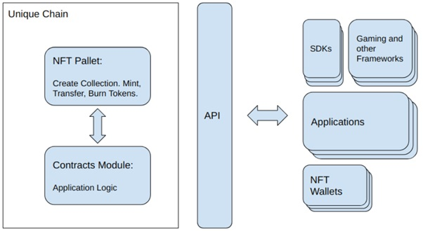

{ width="800" height="600" align=center }

---

> **MFS: a music NFT decentralized platform**

> *As merry as a mars cricket*

> **Play, Mix, Own, Govern, Earn, Self-releasing, Blanket licensing, Co-Owned, M2E, and Pay as you go TRXs**

---

> NOTICE OF CONFIDENTIALITY([Terms and Conditions](Concern_Legal/Agreement_Legal.md))
Case studies, comparisons, statistics, research, and recommendations are provided “AS IS” and intended for informational purposes only and should not be relied upon for operational, marketing, legal, technical, tax, financial, or other advice. AramisTech . neither makes any warranty or representation as to the completeness or accuracy of the information within this document, nor assumes any liability or responsibility that may result from reliance on such information. The Information contained herein is not intended as investment or legal advice, and readers are encouraged to seek the advice of a competent professional where such advice is required. All of details of papers were registered. The paper that you are reading is not a final version, so it is possible that some sections will have minor changes.

> MFS is the short name of the platform, and it is going to be  mentioned  in the final version of the paper.

---

# Project outline

[TOC]

# Abstract
Nowadays, with the development of technology, we observe an increase in the number of users that use streaming music or podcast services.
Whether you’re a singer, artist, labeler, composer, investor, or simply interested in the blockchain space, there is something new for everyone in the platform. A platform that helps you protect, publish, and monetize your music, while offering transparency and insights on reach, performance, and earnings. The MFS suite of apps consists of various solutions tailored to specific needs. Browse our website to read more about all the features, and feel welcome to register your free account. MFS is the swiss army knife for any music professional.
For the music industry, AI technology is more like a thread than a benefit. e.g., deepfake vocal synthesisers, which make a singer's voice sound like that of a famous artist. Who knows, maybe in the near future we will have a tool called MusicGPT!
At present, there is an opportunity for technology companies and the music industry to avoid repeating past mistakes by considering new technologies, and blockchain is the only solution for making legislation with democracy. 
The proposed work has an engineering journey to reach lucrative revenue streams with non-fungible assets. Unlike any other music distribution platform out there, we also allow our users to distribute music to innovative new outlets. By effortlessly creating NFT collections of your release catalogue, you can enter the world of "Web3", unlock revolutionary ways to engage with fans, and tap into new income streams.

Keywords: NFT, Music, Audio, DApp, Musical sophistication, Active engagement, Blanket licensing

---

# Introduction

## Blockchain
Blockchain, which is a technology for building distributed ledgers that provide an immutable log of transactions recorded in a distributed network, has become prominent recently as the underlying technology of cryptocurrencies and is revolutionizing data storage and processing in computer network systems[^15].
Blockchain-agnostic protocols enable cross-blockchain or cross-chain communication between arbitrary distributed ledger technologies[^16].

<figure markdown>
{ width="400" height="200" align=center }
<figcaption>Fig 1. Blockchain Use Cases[16]</figcaption>
</figure>

## What is an NFT?
Like cryptocurrencies, NFTs are issued on a blockchain, and are used to designate ownership of a certain asset.
Unlike cryptocurrency, NFTs are not fungible, meaning each NFT is unique and not interchangeable with another NFT. For the first time, content on the internet in the form of an NFT can be definitively owned by a specific person independent of a centralized intermediary, and this is unlocking exciting opportunities for digital commerce and engagement[^6].

## Polkadot

<figure markdown>
{ width="300" height="350" align=center }
<figcaption>Fig 2. Polkadot Stack[16]</figcaption>
</figure>

The Polkadot network has several entities engaged in handling transactions: collator, validator, nominator, and fisherman. Collators produce proofs for the validators. Transactions are then executed and aggregated in blocks. There is the possibility of collators to pool, to coordinate and share the rewards coming from creating blocks on the parachains they actuate. Validators produce and finalize blocks on the relay chain. The validator role is contingent on a stake that is put on hold to foment good behavior. Validators who misbehave can have their block rewards denied or, in case of recurrence, have their security bond confiscated. Validators are the equivalent to groups of cooperating miners that share block rewards proportionally to their contribution (mining pools) on PoW systems (e.g., Bitcoin). Nominators provide their own stake to validators, whereby sharing the rewards and incurring potential slashing, in case of misbehaving. Fishermen get bounties for reporting validators’ misbehavior, such as helping to ratify an invalid block. Polkadot’s relay chain uses Substrate. Polkadot’s state machine is compiled to WASM, a virtual environment that can execute the state transition functions. Libp2p is a network library for peer-to-peer applications, written in the Rust programming language. Parachains run the application logic, creating transactions as needed. Collators group those transactions and redirect them to Validators, who then deem blocks as valid or invalid. After that, the valid ones are added to the relay chain.Polkadot uses the DOT token as an incentive for nodes to behave correctly. DOT has several purposes: (i) decentralize governance (i.e., protocol updates), (ii) operation (i.e., rewarding good actors), and (iii) bonding (i.e., adding new parachains)[^16].

Upgrading conventional blockchains requires forking the network, often taking months of work, and particularly contentious hard forks can break apart a community. Polkadot revolutionizes this process, enabling blockchains to upgrade themselves without
the need to fork the chain. These forkless upgrades are enacted through Polkadot’s transparent on-chain governance system[^20].

<figure markdown>
{ width="600" height="400" align=center }
<figcaption>Fig 3. The interaction between the four roles of Polkadot[20]</figcaption>
</figure>

## Unique Network
Unique Network blockchain in the Polkadot ecosystem can be seen as a foundation for standards and good practices serving for any software that uses or relates to NFT. The core components of Unique blockchain are[^1]:

1.  Token Pallets that handle NFTs, RTFs, and Fungible tokens
2.  EVM/Ethereum Smart Contracts

<figure markdown>
{ width="600" height="400" align=center }
<figcaption>Fig 4. Unique Network[1]</figcaption>
</figure>

---

# Problem statement

## Have you heard about the phenomenon of the AI music generator?

This phenomenon has copyright owners rightfully concerned, as AI [music generator](./AI/music_generator.md) outputs are veritable collages of fine-grained sound recording samples[^17].
Therefore, one solution is to establish a blanket licensing apparatus for AI music generator training and output. AI developers—as well as other unforeseen parties looking to use numerous works in the future would have a one-stop shop for securing the rights to any works included under the blanket license. This model has been a longstanding practice in the music publishing industry, which utilizes blanket licensing to grant public performance permissions to various users on behalf of hundreds of thousands of authors[^17].

## Royalty Settlement

Existing streaming services must pay royalties for both digital copy and performance rights,but it is not easy to settle the profits properly that go to artist due to lack of transparency. Due to the difficulty of identification, 25% of the total royalties incurred by streaming services will not be paid[^3].

## Sales Profit
Due to the current distribution structure involving various brokers, the distribution of profits to artists has not been properly paid[^3].

- [ ] High fees for streaming services
Streaming services charge 15-40% of royalties to users in the name of usage fees. Due to the high cost, users refuse to use streaming services and obtain music through other methods such as pirated copies[^3].

- [ ] Geographic difficulties preventing entry into new markets
It is difficult for one singer to enter another country’s market, especially Asian artist’s entry into the American and European markets which is vey rare. Even if the singer is successful in Asian markets, it is hard to guarantee the success in fandom formation by entering new markets[^3].

## Project Vision/Objectives

Our ambition serves personal, collective, and institutional goals:

- [x] Amplify the impact of purpose-driven NFT artists by joining forces to fandom with collective initiatives (shared communication, collaborations, collective exhibitions, etc).
- [x] Create a self-sustainable model for purpose-driven music production / finding an alternative model to the traditional music industry by enabling genuine sustainability.
- [x] Create the first robust online gallery of NFT music playing for the planet.
- [x] Directly support purpose-driven NGOs with sales of donated events and create a new culture of the music supporting purpose-driven projects.
- [x] Establish an ecosystem of Blockchain NFT platform for the fastest way to meet World-Genres in the world without regional restriction.
- [x] Create streaming networks where artists can communicate directly with their fans and easily making profits, and it becomes the most preferred music service-oriented in the world.
- [x] Support the growing aspirations and self-creating activities of artists who are ahead of debut competitors.
- [x] Reduce the broker’s revenue share in the entertainment business revenue structure and build an environment where MFS Token can be used as the best payment method.
- [x] Development and deployment of music LCL, NFT EEC.
- [x] Proposed NFT platform can imitate functions of traditional finance and NFTs.
- [x] Working on roadmap continually.

---

# Background

## Streaming Music On Blockchain
The global entertainment market is expected to grow to about $2 trillion by 2021. In 2018, the music streaming market reached nearly $274 million. In addition, 41% of Internet users in Korea have registered for streaming services, and it is far higher than other countries.
Recently, streaming services which increasingly have improved user convenience have emerged as the most accessible segment in the music market today. For groups of artists performing independently, streaming services is becoming a foothold that creating new types of revenue and moving away from geographic constraints to provide a wide range of audiences with their music. The most important thing is that artists also can improve their skills constantly through these services[^3].

## Smart Contract

Smart Contracts have benefits and considerations in three area includes: digital Identity, Records, and financial Trade[^8].

### Digital Identity

#### Benefits        
1. Securely disclose personal data to various counterparties
2. Reducing liability while facilitating frictionless KYC
3. Increased compliance, resiliency and interoperability
   
#### Considerations
1. Security of smart contracts
2. Technical integration with attestation providers
3. Formation of protocols and standards to deliver interoperability by the involved parties

### Records

#### Benefits
1. auto-renewal and auto-release 
2. Automated processes 
3. Archival data automatically 
   
#### Considerations
1. Storing data on DLT without slowing performance or compromising data privacy
2. Active involvement of lenders and registered agents must exist for more complex functions

### Trade 

#### Benefits
1. Faster approval and payment initiation
2. Automated compliance
3. Monitoring of Letter of Credit conditions
4. Transport-related contract agreements
5. Increased liquidity of financial assets due to ease of transfer and fraud reduction
   
#### Considerations
1. Wider acceptability and adoption
2. Potential smart contract execution fall-out must be determined
3. Integration with settlement systems, off-chain ecosystem

## Non-Fungible

NFTs are created for unlocking new commerce and engagement opportunities with identify the NFT use case.

### Fan Engagement
NFTs can be much more than a collectible or piece of art, and savvy brands are recognizing that the most successful and long-term-relevant NFTs will be ones that have ongoing value and utility. For example, NFTs can better connect fans to their favorite teams or brands by offering voting rights to team decisions, access to exclusive offers, and the ability to earn rewards[^6].

### Customer Relationship Management
Unlike physical goods, NFTs are trackable so it can be possible to see what wallet address they reside in. NFTs can open unique segmentation and engagement strategies based on trackable factors related to the NFTs owned/purchased.This might include the types of NFTs owned, the quantity owned, or the duration they’ve been held[^6].

### New Potential Revenue Streams
Because NFTs enable digital scarcity, brands can sell exclusive, limited digital goods. Unlike physical goods, NFTs can include a smart contract that codes in a royalty percentage designated by the content creator. As such, subsequent sales or auctions of the NFT can generate revenue for the original NFT creator, providing an ongoing potential revenue stream as it is sold or auctioned[^6].

### Collectibles
The digital scarcity that NFTs enable is a natural NFT for collectibles or assets whose value is dependent on there being limited supply. Some of the earliest NFT use cases include CryptoKitties3 and CryptoPunks4 (10,000 unique pixelated characters), with individual CryptoPunk NFTs like Covid Alien selling for $11.75 million5. More recently, popular brands are creating NFT-based collectibles, like NBA Top Shot moments, which are digital basketball cards, but instead of static images, these NFTs contain video highlight moments from NBA games[^6].

### Art
NFTs enable artists to sell their work in its natural form factor as opposed to having to print and sell pieces of art. Additionally, unlike with physical art, the artist can receive revenue upon secondary sales or auctions, thereby ensuring they are recognized for their original creations in subsequent transactions. NFT marketplaces devoted to art-based NFTs, such as Nifty Gateway, sold/auctioned over $100M of digital art in March 2021[^6].

### Re-fungible and Fungible Modes
Re-fungibility is an important step towards building real life models of ownership rights. Often a unique item may be owned by multiple entities in different proportions. The examples of such shared ownership are abundant: Timeshares, co-ownership of art, fractional car ownership, etc. For that purpose Unique Network provides the special mode of Collection: Re-Fungible. The Re-fungible token can be minted and then partially transferred to multiple owners.  
Fungible collection mode is targeted at the same set of use cases as ERC-20 tokens: Any non-unique and divisible resource can be represented as a Fungible token. While these use cases are not the prime focus of Unique Network, many applications need this functionality in parallel to the NFT the examples include: Non-unique game resources (such as game money),rating points in applications with social networking capabilities, voting tokens, etc.[^1].

## Consensus and Tokenomics
The Unique Network use the Relay chain consensus, as any Polkadot parachain does, and off-chain mechanisms for Collator incentivization, which is important for decentralization, prevention of censorship attack [26], and improving the user experience due to reducing node latency for client responses[^1].

### Unique Token
Unique Token is the Unique Network token that is used for several purposes[^1]:

1. Transaction rate limiting and DDoS protection in form of transaction fees.
2. Network Services
3. Application data storage rent
4. Advanced features of the network
6. In-app payments through payable smart contract methods
7. App promotion program
8. Paid Rate Limits

## Ownership

The application developer would create the collection and become its owner. [Ownership](Collection_Management/ownership.md) of collection means the full authority over all of its properties and NFTs, including the capacity to destroy the tokens and the collection or give up this authority by transferring the ownership to an address with an unknown private key[^1].

### Operating NFTs
Once the collection is created, its owner can mint tokens that belong to this collection. The minting process is an atomic operation of creating an NFT item, setting this item’s immutable metadata and its owner[^1].

## Standards

The Interchain NFT and Metadata Standardization conducted extensive research of NFT token and their Metadata standards. Unique Network aims to comply with this interchain standard and deliver the network protocol that is applicable to and able to describe a wide range of NFT formats known in order to prewire the NFT interoperability for most if not all known NFT standards, which is explained in detail further[^1].

### ERC-721
It provides capability to mint, burn, and transfer tokens. The methods such as allow and transferFrom enable withdrawing tokens on owner’s behalf. It is also possible to include random data in the transfer transactions and perform safe transfers that verify that the
receiving party (a smart contract) is capable of receiving the NFT token and can handle it by executing a on ERC721 Received call-back method. All these features are or will be covered by the basic functionality of NFT Pallet, which is in the core of Unique Network.
Also, the ERC-721 standard describes the ERC721 Metadata metadata standard, which includes collection name, token symbol, and token URI. Collection name, description and symbol (token prefix) are the properties of any Unique collection, and token URI can be set as a
part of the Off-chain schema. Token supply as well as BalanceOf parameters also translate one to one to Unique collection parameters: number of created tokens and balance[^1].

### ERC-1633
Refungible standard is covered by Re-Fungible mode in Unique NFT Pallet[^1].

### ERC-1155
ERC-1155 standard mainly adds batch operations on top of ERC-721. This functionality is not directly changing the data formats for NFT, but is a convenient way to automate and optimize operations on multiple NFTs. Also, even though the batch minting is not explicitly included in ERC-1155, Unique implements this feature as well, and will implement batch transfer operations[^1].

### ERC-994 and ERC-998
Delegated NFT and Composable NFT add the relationship layer, e.g. “NFTs are arranged in a federated, tree-like format”. In order to stay efficient while accommodating this functionality, Unique Blockchain will add a pallet that will allow to create directed labeled
interconnections between NFTs. The NFT Relations section explains the relationships between NFTs in more detail[^1].

### ERC-809 and ERC-1201
Ownership is a capacious term, which serves as an umbrella for many rights that authorize entities for many different actions. Due to this reason, it is important to create the framework capable of providing granular definitions and enforcements for these authorizations. Renting of NFT described in these standards are only a small subset of such authorizations, which will be covered under Advanced Ownership Structure[^1].

### EIP-4337
EIP-4334 is an account abstraction proposal which completely avoids consensus-layer protocol changes, instead relying on higher-layer infrastructure. It seeks to achieve the following goals[^7]:

1. Achieve the key goal of account abstraction 
 allow users to use smart contract wallets containing arbitrary verification logic instead of EOAs as their primary account.

2. Decentralization
 Allow any bundler (think: block builder) to participate in the process of including account-abstracted user operations.
 Work with all activity happening over a public mempool; users do not need to know the direct communication addresses (eg. IP, onion) f any specific actors.
 Avoid trust assumptions on bundlers.  

3. Do not require any Ethereum consensus changes.
 To increase the chance of faster adoption, this proposal avoids Ethereum consensus changes.

4. Try to support other use cases
 
 Privacy-preserving applications
 
 Atomic multi-operations (similar goal to EIP-3074)

> Pay tx fees with ERC-20 tokens, allow developers to pay fees for their users, and EIP-3074-like sponsored transaction use cases more generally[^7].

> Support aggregated signature (e.g. BLS)[^7]

### Counterparty
Simple yet flexible Counterparty standard adds the capability similar to ERC-721 to Bitcoin protocol, as well as ERC-1633: Fractional Ownership or Re-Fungible. the Unique metadata schemas are fully compatible with OpenSea standard[^1].

## Interoperability

Another important feature for existing Ethereum users will be emulation of ERC-721, ERC-20, and other Ethereum standards through RPC calls. These RPC endpoints will enable transparent use of native Unique Network capabilities in Ethereum tools in the same manner as Frontier, i.e. Metamask, Truffle, Web3 libraries, etc. The dApp developers and publishers will be able to seamlessly convert their user bases to Unique with zero learning curve for their users[^1].
Furthermore, the off-chain service can be an additional factor that limits the performance. For off-chain integration, the REST API can be utilized to pass the data to be computed to the outside. However, the REST API will also have certain limitations from a performance perspective.Therefore, alternative integration techniques such as gRPC can be used[^10].

## Fee

Unique Network is going to offer several gas [fee](/DEFI/fee.md) models for its users in order to provide as much flexibility as possible to adapt to miscellaneous marketing strategies of application developers and remove UX friction for the newcomers.
The gas fee model is configured separately for each Collection or a smart contract. Every Collection and smart contract has a fee model assigned to it, which determines how its transactions are paid, and the developer can choose the fee model that better suits their application[^1].
Initially the fee model is configured to a default one and can be updated later at any time and as many times as needed.Currently there are two models implemented: The default “User paid fees” model when the transaction sender pays all gas fees, and the “Pay as you go” model when collection or smart contract owners enable sponsoring for certain transaction types for their users[^1].

### Layers
1. Off-chain community
2. Off-chain development
3. On-chain protocol
   
### Dimensions
1. Roles
2. Incentives
3. Membership
4. Communication
5. Decision Making
6. Format and Context

## DAO
It is usually encapsulated in a set of rules and procedures that regulate conduct of participants in a system. Moving to more decentralized forms of governance, ideally performed on-chain, requires modifying corporate governance processes to fit the idiosyncrasies of blockchains.
In the DeFi and blockchain space, governance, decision-making and operations are typically performed through [DAOs](./DAO/DAO.md).
The BG framework, defining the governance structure of a blockchain as a combination between six governance dimensions, and three governance layers[^19].

<figure markdown>
{ width="600" height="500" align=center }
<figcaption>Fig 5. DAO[15]</figcaption>
</figure>

## Royalty Management

### When I buy music rights through Royal, what do I get?
When you invest in songs or albums on [Royal](./Royalty_Management/Royalty_Management.md), you get a token representing a percentage of the music’s streaming rights, plus extras. You earn royalties alongside the artist and get paid when they do.
Artists choose what percentage of the song's royalties to drop. They can also attach extras like fan experiences, exclusive tracks, merch, and more—it's all up to them[^4].
### How do I buy a token during a drop?
During a drop, you can buy a token through Royal’s website with a credit card. Before you buy, you’ll be able to see the percentage of ownership per token tier, the extras attached, and information about pricing[^4].
### If you get a token during a drop, it will appear on your Royal dashboard. Missed out on a drop? 
You can buy a token on our music rights marketplace.
Create a free Royal account to receive email notifications about upcoming drops. You can also follow us on social media to keep up with the latest releases[^4].
### How do I claim streaming royalties?
Once you buy a token, your royalties start accruing as the song, EP, or album streams on platforms like Spotify and Apple Music.
You get paid your portion of the royalties when the artist gets paid. The time to payout will vary depending on the artist—on average, payouts happen every 6 months—and we’ll notify you when royalties become available to claim.
Once available, you’ll claim your royalties in your Royal dashboard by transferring funds to another crypto wallet[^4].

### Can I sell my token?
Yes, you can list your token for sale any time on royal.
One exciting part of purchasing music rights is that these assets may appreciate—artist and song popularity, token demand, extras, and more can all play a role in secondary pricing.
Once you sell your token, royalty payouts and unclaimed extras will go to the new token owner[^4].

Royalty advances are essential to musicians because they provide a source of upfront income before the actual royalties from music sales and streams start coming in. This can be particularly useful for musicians who are just starting out, or for established musicians who need financial support to produce new music, pay for promotional activities, or cover living expenses[^2].
A royalty advance is similar to a loan that a record label or publishing company provides to a musician, based on their expected future earnings from music sales and streams. The advance is then recouped from the artist's future royalties. In other words, the artist repays the advance by dedicating a portion of their future earnings to the lender[^2].

## Label Management

[Label Services](Label_Management/Label_Management.md) are a fundamental building block of our more robust peer-to-peer platform. This deployment will give access to creative services, playlist pitching, PR services, and advertising for artists and labels on the platform[^2].
It is our intention to build this within Circle’s USDC ecosystem. The advantages of using USDC to transact include removing volatility for crypto payments, allows Unchained Music to accept Credit, Debit, Bank Transfers, and Bank Wires, and hedges against potential stablecoin regulation in the United States by working with the most reputable company issuing a centralized stablecoin today[^2].
Future iterations of the label services platform will allow the Unchained Music token to be used for discounts on these services.[^2]
During this initial deployment we will start to deploy our V1 smart-contracts, which will be built with the intention to allow other service providers, musicians, and other creatives to operate within the peer-to-peer platform upon launch in 2024.[^2]

## Properties

### Metadata Schemas
One important property of a collection is the Off-chain [Schema](Collection_Properties/schema.md). This schema describes the metadata that is associated with each token and can be accessed by the token ID. It can be an image or a more complex and structured data. For additional protection of token authenticity, the off-chain metadata hash can be recorded in the immutable token metadata. Besides the off-chain schema, it is possible to set the similar schemas for mutable and immutable NFT metadata that are stored on-chain. The main purpose of the off-chain and on-chain schemas is allowing the standardised definition of application specific token data[^1]. 
Standardization is important in order to set the grounds for interoperability between multiple chains, but also is flexibility. Unique Network sets the goal to support many standards to stay interoperable and at the same time flexible enough to accommodate new schema standards as they appear. Thus, the Network does not restrict the schema to any format, but allows to select the format out of existing known standards to the moment: ERC-721, OpenSea, or Tezos. The NFT wallets will be able to read the schema version that is stored on-chain and display the NFTs appropriately[^1]. 

### White Lists
Depending on the application design and requirements, the collection may be accessible for a wide audience or for a restricted and private group of accounts. In the latter case, a white list access mode may be enabled to restrict capabilities of owning and transferring tokens by only accounts included in the white list[^1].

### Private and Public Minting
The Collection owner may choose to allow non-privileged users to mint tokens in their collection by enabling the public minting mode. Combined with the White Lists, this could be a powerful tool for applications that require their users to be able to create their own tokens, such as art galleries, some games or applications for collectors[^1].

## Comparison of platforms

[Appendix](./Appendix/Appendix.md "jump to the appendix")

---

# Solution

Having more features in a system shows that it has a competitive advantage. Because of the use of underlying layers of Unique There are a lot of features to the proposed work. Every layer injects features into another layer. So, the properties of every layer are inheritable. MFS use the unique parachain as the settlement layer.

## Core Business

`Business Areas`
-   Music production, artist management & marketing, record label management, copyright control

`Music Business`
-   Album, digital music, concerts & performances, events, advertising, merchandising, royalty management, auction

`Media Production`
-   Concert production & operation, playlist, fandom channel

> The Successful Factor of Entertainment Business:

`Artists`
-   Need a competitive celebrity with talent

`Marketing & Plan`
-   Frequent exposure on partnerships of platform, the press, social media, and other media
-   Create albums to meet current music trends

`Producing`
-    Produce sound sources with high-quality and popular music preference.

`Fandom`
-   Form a fandom culture that can increase the artist’s brand awareness.
-   Encourage fans to spread the message that ‘the artist is popular.

> The core functionality of the exchange would be implemented in asset layer and in the protocol layer of the DeFi stack.

## Actors 

- [x] Singers
- [x] Songwriters 
- [x] Record labels
- [x] Publishers 
- [x] Artist managers
- [x] Digital content creators 
- [x] Web2.0 accounts

## Building a relationship between artists and fans
A&R mint a podcast or singer practices what it promotes and issues free NFTs to its fans as a way to reward its loyal listeners, grow its audience and generate excitement. Issue free NFTs to get new listeners to make a ripple effect.

## Progress Phases

### Initiating

- [x] Support rights and intellectual properties.
- [x] Read helpers and FAQ section of the platform.

### [Planning]

- [x] Making a plan by A&R (single producer doesn't need this step)
- [x] DAO A&R-oriented
  
### Executing

1. Record & producing by a singer, [mixer & masters], [LCL] of the platform.
2. Making a plan by A&R
3. Mint free NFTs
4. [Presale]
5. Mint track/album NFT

### Monitoring and controlling

1. Filter & Search
2. Promotion
3. Management
4. Monitor

### Closing

- [x] Transfer NFTs to wallet
- [x] Fandom channel
- [x] DAO investment-oriented
- [x] Utilizing actors' earnings are determined in some way by the defi mechanisms of the platform.

## Proposed Architecture

<figure markdown>
{ width="800" height="600" align=center }
<figcaption>Fig 6. Proposed Architecture</figcaption>
</figure>

## Sovereign and governance
Decide how to keep safe actors in a long-term sustainable way.

### DAO & Governance Tokens
Allowing collective ownership & decision making of proposed protocol. Only governance token holders can submit and vote on protocol governance.
We offer a decentralized autonomous organization([DAO](./DAO/DAO.md)) rather than a corporate governance model.
Using only a whitelisted strategy is not enough, and implementing a credential strategy would help with staking as a hybrid governance model. Mitigating the issues with token governance is possible.

### Delegation
token holders may delegate their voting power to more active/informed users. So, this may not exacerbate plutocracy. Because every delegation deserves to active users but not users deactivate.

### Non-token governance
Proof of humanity (one person, one vote), proof of participation, and proof of contribution have been proposed. Each comes with its own method.

### Accountability
Making voters accountable for the consequences of their actions by imposing penalties and rewards based on the outcome.
  
### Voting Governance Model
Governance token holders can delegate their tokens to others (who do not even need to hold GT) to vote.Proposed platform will have the capability to propose (submit MFS Improvement Proposals, or MIPs) and vote.Participants must lock up their MFS (MFS DAO's governance token could called vote escrowed MFS/veMFS) by transferring them from their private wallets(On Polkadot known controller account) to the voting contract (from where they can be later withdrawn). MFS holders can lock their tokens so they can obtain veMFS in order to gain voting and proposal making powers. There is voting power minimum, but a user must have veMFS to create a proposal.
(Imagine, The protocol uses a multi-DAO structure consisting of independent sub-DAOs that, combined, form the protocol governance. MFS holders can vote for changes, but decisions are sent, as a delegated transaction, to the Multisig, which either executes or vetoes the transaction.)

---

## Features and Prerequisites

|          X              |  DApplication |  Smart contract |          DAO         |
|-------------------------|---------------|-----------------|----------------------|
|     Prerequisites       |      All      | Framework, NFT  |  SC, Treasury, Token |
|                         |               |    Libs, Token  | Improvement proposal |

|       Features          |     DApp      |       SC        |           DAO        |
|-------------------------|---------------|-----------------|----------------------|
| Self-verifying          |               |       *         |                      |
| Self-enforcing          |               |       *         |                      |
| Self-executing          |       *       |       *         |           *          |
| Upgradeable             |       *       |       *         |           *          |
| Tamper-proof            |       *       |       *         |                      |
| Security/reliability    |       *       |       *         |           *          |
| Anti-Attack             |       -       |       *         |           *          |
| Low Power consumption   |       *       |       *         |           *          |
| Tokenization            |       *       |       *         |                      |
| Solace of scalability   |       *       |       *         |                      |
| Sustainability          |       *       |       *         |           *          |
| Resilient               |               |       *         |                      |
| Agnostic approach       |               |       *         |           *          |
| Deterministic governance|               |       *         |           *          |
| Community trust         |       *       |       *         |           *          |
| Consensus threshold     |               |       *         |           *          |
| Governance tokens(GT)   |       *       |       *         |           *          |
| GT Earned               |               |       *         |           *          |
| GT Minted               |               |       *         |           *          |
| GT Gifted               |               |       *         |           *          |
| GT Bought and sold      |               |       *         |           *          |

`Gathered source: Internet`

---

## Safe digital assets in a long-term sustainable way
The frontend UI hosted on IPFS. It consists of several pages powered by ReactJS. There is an integrate with NFT Chain by means of Polkado{.js} browser extension, metamask and PolkadotJS API.
DApp supports Web3 wallets so users can lend and borrow founds directly through their UI.
Unique and Polkadot.js are easy-to-use wallet that are perfect for non-technical audiences who are storing assets, who love our white-label solution.

## Collection

- [x] MusicPunks NFT collection created in NFT Pallet with 1000 minted NFTs. Each NFT has the MFS ID and on-chain properties that determine the look of the character.
      
- [x] Matcher smart contract that stores current market state and matches incoming bids from the UI against existing ask offers. This contract is written with Rust.

### Management
It is hard to overestimate the importance of Ownership in human society. Ownership defines the exclusive rights and control over the property. Thus property, ownership, and rights are one of the most important mankind essentials. It is important for one’s solid realization of the universe to build a correct and precise model of ownership and rights.
Another important right that collection ownership gives is [administrator](Collection_Management/administrator.md) who is would be labeler. An administrator of collection is the account that has elevated privileges over common users, but slightly less than a collection owner. As such, only the collection owner can destroy the collection and add administrators. This permission level was mainly aimed to allow automated operations over collections, such as minting tokens on demand. Also, a [smart contract](/Smart_Contract/smartcontract.md) can serve as a collection administrator to allow advanced decentralized application logic such as Claiming free [MusicPunks](/Collection_of_App/MusicPunk.md) , for example.

## Mint the NFTs
MFS flexes the sustainability known with underlying Unique framework— a NPOS network with a much lower carbon footprint than Ethereum. You can mint NFTs without worrying about impacting the environment, and focus more on your finished product. Unleash your creativity, build the next-gen NFT ecosystems in a way that are climate friendly!
the NFT pallet allows storing the NFT metadata in order to allow more authentic definitions of NFT items, while staying agnostic of this metadata format. The Substrate framework provides a robust and flexible WebSocket API allowing connections to the Blockchain to be established by its clients: NFT wallets, Marketplaces, and other programs.
On MFS DApp, creating NFT collections is easy, free, and secure, without ever needing to write a single line of code! We give you the option to mint any digital asset, and both owners and administrators can manage collections.
Burn MFS token-> Mint NFT

## Marketplace
The type of the marketplace is a crypto native curated marketplaces that require contributors to be approved to create NFTs and sell them on the platform. Similar to the open marketplaces, they require cryptocurrencies for payment, and have consumers custody the assets themselves.
You don’t need to have deep blockchain knowledge to understand, build and enjoy our NFT, which allows for the safe and trustless exchange of NFT or RFT assets, sponsored transaction fees, subscriptions, and scheduled transactions.

## Fan Governance and Decision-Making
NFTs can be used to enable fans to impact decisions and outcomes of the albums or a specific concert. labelers are starting to explore NFT assets that grant fans certain permissions, such as voting rights for team decisions, the ability to compete in events and leaderboards, and earning MFS rewards and VIP experiences linked to their teams.

## Ticketing
In addition to being collectables, NFTs can be combined with event tickets to provide access to an event. These tickets can provide verifiable authenticity, provide royalties upon secondary sales or auctions, and even turn digital tickets into unique commemorative assets.

## Playlist
Whether you’re showcasing past drops or highlighting your newest NFTs, the customization options and new tech integrations give you the option to choose how your visitors will view your work. 

## Properties
#### Private and Public Minting
DApp has inherited only public minting and creating an optional whitelist for A&R to make limitations based on location, genres, sex, and age. In addition, allowing the following schemas.

|   type of metadata  |  off-chain | on-chain | mutable |immutable|
|---------------------|------------|----------|---------|---------|
|          NFT        |            |     *    |    *    |     *   |
| Token of collection |     *      |          |         |     *   |

---

## The next phase of digitizing art assets

### Benefits
- [x] Ease of use. Tokens are trivially created, stored, traded
- [x] Fractional Ownership. Think of the prohibitively expensive music track in the concert or NFTs such as MusicPunks.
- [x] Tokenization allows investors to own fractions of the asset. Accessibility. Again, think of the volume of transactions in music market or physically distributed, versus the volume of transactions in NFTs or crypto.
- [x] Market efficiency. Tokenization may smooth out boom-and-bust cycles of illiquid markets by making them more liquid and organized.

### Challenges
- [x] Generally, not decentralized: intermediaries will ALWAYS be needed for non-native assets.
- [x] Legal recognition

## Tokenization

### MFS Token Benefits
The goal of MFS Token is to become a cryptocurrency that can be used in various ways, including defi, concerts, events, and every kind of future purchases. The MFS looks forward to achieving this vision with unique apps and token plan that make a huge difference in token trading and distribution. MFS Token enables music and album sales in the new market through instant payment and Blockchain-based streaming service as well as promotions, and it will bring innovation to the market. To achieve this vision, the MFS will promote the project through various media and continue steady marketing activities.

## Sponsoring scenario
Artists need to produce/promote their work, go on tour. Financing options are limited with loans (Debt).

1.  Alice(as labeler or A&R) is a promising musician,songwriter or a singer at her early famous stages.
2.  She needs $100,000 for equipment, practice, training, traveling to go local concert.
3.  She signs up at the platform, builds her profile, signs a smart contract with the platform and then 100,000 tokens (each valued at $1) are issued.
4.  Tokens are sold to investors. Alice receives $100K, while investors get the rights to 30% of her future income for a fixed period.
5.  Alice invests the funds on professional practicing and participation in events around the world.
6.  After a few years, Alice has developed into a professional player earning $300,000 a year.
7.  Of this income, 30% (i.e. $90K annually) is distributed to token holders via the NFT platform.
8.  Investors receive income (dividends) and can sell tokens, which will fluctuate in value according to income/maturity.

### Overview of Token Valuation
Think of tokens like a stock, which builds value from…

- [x] Dividends
- [x] Buybacks
- [x] Price appreciation
- [x] Size of the market
- [x] Number of tokens
- [x] Momentum and price dynamics

### Token distribution

<figure markdown>
{ width="600" height="600" align=center }
<figcaption>Fig 7. MFS Token distribution</figcaption>
</figure>

## Deal with digital assets in a long-term sustainable way
### Liquidity Provider (LP) Tokens
LP tokens represent shares in liquidity pools, used in decentralized exchanges.
### The MFS Staking
The MFS Staking Hub has made it easy for users to [stake](/DEFI/stake.md) and unstake [UNQ](/DEFI/unq.md)  and [MFS](/DEFI/MFS.md)  tokens, supporting the development of the MFS decentralized application. By betting their tokens, users can earn rewards while contributing to the growth of the blockchain. The staking program offers a percent of APY, generated through inflation and funded by the MFS Treasury.
Additionally, the application allows users to grow their capital while sponsoring dApp transactions and supporting the MFS application. With partial unstaking, users can easily manage their funds, providing better liquidity access.

### Enabling NFT Exchanges and Auctions
There are usually three different types of auctions to choose from:
1. Reserve auction: An auction where interested buyers can only make bids equal to or higher than your reserve price. 
2. Scheduled auction: A timed auction has specific start and end times. It’s an ideal option to sell a piece quickly or during a particular event.  
3. Unlimited auction: In this case, interested buyers bid until you accept one.

## Platform Infrastructure Costs
Operating a proprietary marketplace rather than leveraging an existing marketplace can provide additional control over the assets, where the files are stored, and how they are consumed, but comes with additional costs. In addition to marketplace sale or auction fees and transaction costs, there are other infrastructure costs like payment acceptance and custody.
The NFT marketplace charge a fee when sales or auctions occur on the application, usually ranging between 1% to 3% while there is fee 5% in so many NFT platforms.

## Store and access NFTs securely and easily
Distribute across an applicable marketplace.The Cryptopunks project was developed by Larva Labs in 2017, then a two-person team of Canadian software developers who took inspiration from the cyberpunk movement, edgy electronic music, and films about a dystopian, technological future like Blade Runner. This project was also an inspiration for the ERC-721 standard, becoming a framework on the blockchain for the birth and continual growth of non-fungible tokens. We believe that [MusicPunks](/Collection/Collection_of_App/MusicPunk.md) will be the best case study for Unique NFT capabilities. We’re equally excited to deploy additional advanced features for NFTs.
The iconic Cryptopunks, one of the first ever NFTs. Also released in a collection of 10,000 (four years prior in 2017), Cryptopunks helped set the scene for the immense energy of the burgeoning NFT community.
As of writing, the lowest price available to pick up a Cryptopunk of your own is almost 81.99 ETH ($280.52K) and rare punks are selling for upwards of $10,000,000.
If you're going to publish an NFT collection, why not kick it off with a moment that truly flexes the platform's power and gives users a taste of what to expect from the future? Say hello to [Chelomusic](./Collection_of_App/Chelomusic.md).
Chelomusics are a collection of 1000 NFTs, built on (Unique)[Unique/Unique.md], that will be going live on our Marketplace over time. Not only was this drop a significant milestone to showcase how our product allows creators to build on [Polkadot](/Polkadot/polkadot.md), but it was an early look into our dedication to building a new kind of efficient community on the blockchain.
The Unique-based Chelomusic Collection saw most of the 1000 MFS, randomly generated, characters (e.g genres, types of mixes). This sale will have welcomed a variety of new users to Polkadot and shows them NFTs on this network can shake some of the constraints that many users face running on ETH (slow network speeds, limited feature set, lack of scalability).
For Chelomusics holders, one could say owners and buyers sensed that they were a part of another historic moment for digital collectibles — the NFTs available on Unique. Who wouldn't want to hold one of the next Cryptopunks?

---

## Our Proposed unique platform - The Trusted Engine of Commerce

> What makes MFS so special?

### NFT EEC
#### Unique moments or elements from a particular song or album
A NFT could represent the guitar riff from a famous rock song or the chorus of a beloved pop hit. Fans could collect and trade these NFTs, which would give them access to exclusive content or experiences related to the music.
Another idea is to create NFTs that represent ownership or participation in the creation of a piece of music. For example, a musician could release a song and offer NFTs that represent co-ownership of the songwriting or production royalties. Fans who purchase these NFTs would then earn a percentage of the revenue generated by the music.

#### Unlock exclusive experiences related to a particular artist or band
A fan could own a NFT that gives them access to a private concert or meet-and-greet with the artist.

### Music LCL
We provide a feature for users who can generate a music by writing code and then export it, or even songwriters can create an idiosyncratic NFT as an image with metadata about the artwork.
Finally, the live producer can mint an NFT for the exported fresh code!

<figure markdown>
{ width="600" height="400" align=center }
<figcaption>Fig 8. Sample live code-Generate sounds</figcaption>
</figure>

### NFT minor ownership
Due to our unique blockchain network capabilities, we have the ability to fractalize NFTs in some ways. We spoke about ownership before.

---

# Miscellanea And Concerns

## Exit Strategy
Exit! Exit! Exit! Our innovation ecosystems are focused on this goal above all else, thanks to the reliance on venture capital. Young potential entrepreneurs talk about exit strategies before even creating an innovation or starting a business. Our innovation ecosystems push them to do so in many ways. Seemingly straightforward questions to budding entrepreneurs such as “What is your exit strategy?” drastically shift focus and outcomes away from creating long–term societally beneficial innovations. We argue that this hypergrowth exit mindset is destroying societal wellbeing due to its laser focus on increasing socially constructed exit value above all else[^14]. 

## Risk Management
Many NFTs have high monetary value and given their exchange velocity (digital assets can be exchanged much more quickly than physical assets), there is opportunity for fraudulent activity. To minimize this risk, NFT platforms should leverage KYC and AML procedures, as well as security best practices like two-factor authentication[^6].

## Licensing and T&Cs
It is important to be clear what rights are bestowed to owners of the NFTs, and whether these are the same or separate from the rights associated with the material object the NFT refers to. These terms are generally provided contractually in Terms and Conditions from the creator or the ecosystem operator’s platform rules. Brands with strong IP generally retain all the rights, allowing very limited rights for personal use, while newer crypto-native projects may provide owners greater commercial rights[^6].

## Copyright Control
Due to NFTs are new, there is limited legal and regulatory clarity on how existing laws may apply. Laws that may be implicated include contract, property rights, intellectual property, sweepstakes/promotions, privacy, and securities laws. Furthermore, adding to the complexity, since blockchains operate across jurisdictions, transactions involving NFTs can implicate laws outside the United States. Lawmakers, regulators, and courts are still in the process of evaluating how to treat NFTs under existing laws, and whether new laws are needed to protect collectors, artists, and other participants in the NFT ecosystem. Accordingly, it is highly recommended that businesses consult an attorney that has the relevant subject matter expertise. Due to the regulatory uncertainty, there is risk in any transaction involving NFTs. So,[copyright control](Copyright_Control/Copyright_Control.md) is really important[^6].

## AI

[AI](AI/AI.md) music generator outputs potentially infringe the rights of music copyright holders. Specifically, by up-sampling copyrighted works in finely encoded segments, AI music generators create tapestries of coherent audio from the works they ingest in training, thereby infringing the United States Copyright Act’s reproduction right[^17].
Under English copyright law, works generated by AI, can theoretically be protected as works "generated by computer in circumstances such that there is no human author of the work".Under UK law, it is not clear which of the fixed categories of copyright 'works' would protect a voice[^18].

When a track by artist "Ghostwriter" was uploaded and then promptly removed from streaming services in April, it was the latest example of one of 2023's most astonishing trends. The track 'heart on my sleeve' sounded like it was sung by two of the world's biggest stars, Drake and The Weeknd. In fact, it was actually someone who had used an AI tool to make his voice sound like theirs[^18].
This moment presents an opportunity for technology companies and the music industry to avoid repeating past mistakes by addressing this new disruptive technology as partners, rather than opponents[^17].
This great leap forward is made possible by the use of neural networks called variationally autoencoders (“VAEs”), which compress the cumbersome sequences of raw audio in lower-dimensional spaces where they can be efficiently processed without sacrificing structural perceptibility. The VAEs allow the audio to be analyzed at multiple compression levels to develop a holistic understanding of what is occurring in the music[^17].

the model reacts to the user’s inputs (i.e., artist, style, genre, etc.) by predicting how the respective musical elements should be redistributed, thereby generating a sample that is subsequently refined in stages from low-to-high levels of musical detail(“up-sampling”). Once the code is up-sampled to its most detailed level of musical abstraction, it is decoded back into raw audio, resulting in a new song containing the user’s desired qualities[^17].

Once the code is up-sampled to its most detailed level of musical abstraction, it is decoded back into raw audio, resulting in a new song containing the user’s desired qualities. In sum, when a generative model is engaged to make a new work, the audio that manifests as output is merely a tapestry of up-sampled sound recording fragments manipulated to resemble something ostensibly novel. Thus characterizing the AI generator’s output as “original” is misleading, because doing so disregards the role that reproduction of copyrighted works plays in generating the sample. Accordingly, we must assess whether the mechanics of machine-learning music generators can be reconciled with the protections afforded creative authors under the Copyright Act[^17].

Although research into AI music generation had already been ongoing for two decades prior to the enactment of the 1976 Copyright Act, it is unlikely that Congress envisioned machine learning as an approach to sophisticated music generation. The courts’ apparent inability to settle on a consistent reading of the Copyright Act with regard to digital sampling foreshadows the interpretive challenges that lie ahead in the AI era[^17].

Sadly, recognition is not always tied to pecuniary benefit in the music business, and it cannot sustain the musician who requires financial security to continue creating[^17].

Humans may find themselves helpless to compete in the market against the AI systems of tomorrow, which generate their wealth of musical know-how from the same human authors they are likely to displace. Accordingly, courts and policymakers must consider equitable, licensing-based solutions to promote a mutually beneficial AI music ecosystem for technology companies and copyright owners alike. AI may indeed someday change how music is created and consumed for the better, but we must take care not to disregard the significance of the human element in our haste to realize technology’s promise for the future[^17].

One of the latest innovations in AI technology is deepfake vocal synthesisers which make a singer's voice sound like a famous artist or even tools which create a wholly synthetic voice[^18].

---

# Overview of the team

The MFS team has extensive experience across all relevant sectors - from e-commerce, to cryptocurrency, marketing, blockchain, music production, and web application. Crucially, the team has ”done this before”, and possesses all the experience needed to realize MFS.

<figure markdown>
{ width="600" height="400" align=center }
<figcaption>Fig 9. MFS HR-Chart</figcaption>
</figure>

> [Arman Riazi, Co-Founder & CTO](https://armanriazi.github.io)

- [x] Over 12 years experience in software engineer
- [x] Over 4 year experience in Web3
- [x] Broad experience of startups and within e-commerce
- [x] Extensive background in web development
- [x] Active blockchain researcher and mentor
- [x] Solutions architect within distributed/decentralized computing
- [x] MSc, Information Technology
  

---

# Roadmap

The decision is made to build an on-chain marketplace PoC to facilitate safe trading, explore the possible dApp architectures, experiment with miscellaneous types of loads, and discover and overcome possible problems in a developer-friendly environment. The research and development in MFS will be a continuous process with a result of miscellaneous PoCs and further implementation in MainNet or ecosystem tools in case if the corresponding research project succeeds. Advertising and inviting famous artists are parallel tasks during the season.

[Appendix](./Appendix/Appendix.md "jump to the appendix")

<figure markdown>
{ width="600" height="400" align=center }
<figcaption>Fig 10. Finance stack[15]</figcaption>
</figure>

## 3Q 2023
- [x] Market analysis and Research
- [x] Project planning
- [x] White and yellow paper
- [ ] Private fund-rising
- [x] Team up & Relocation
- [ ] Providing infrastructure for remote working

## 4Q 2023
- [ ] Release of MFS DApp Marketplace:Alpha
- [ ] Release of MFS DApp Marketplace:Beta
- [ ] Music Distribution

## 1Q 2024
- [ ] Playlist
- [ ] Supporting music streaming, downloading service
- [ ] Launching LCL service
- [ ] Tokenization
- [ ] Presale
- [ ] Royalty management

## 2Q 2024
- [ ] Record label management
- [ ] Launching DEFI stacking program

## 3Q 2024
- [ ] DAO
- [ ] Auction
- [ ] Copyright control

## 4Q 2024
- [ ] Launching EEC service
- [ ] Data Analytics
- [ ] Maximize services utilization
- [ ] Maximize token utilization

## 1Q 2025
- [ ] Supporting token payment service by mobile APP (iOS & Android)
- [ ] Release of MFS Mobile DApp Marketplace:Alpha
- [ ] Release of MFS Mobile DApp Marketplace:Beta

---

# Future work

MFSgotchi is an virtual studio and designed to be a fun and interactive way for Actors to earn rewards while participating in DeFi activities.

- [ ] Actors/A&R can collect and trade NFTs called MFSgotchis.
- [ ] Actors can earn rewards by staking UNQ tokens to generate yield, which can then be used to purchase and upgrade their MFSgotchis.
- [ ] The program also includes a staking system, where actors can earn additional $MFS by staking their NFTs. Players can earn governance tokens by participating in the fandom's Explore-to-Earn feature or by staking their NFTs in the studio's staking pool.

Artists can carry out marketing activities on the platform for their projects and the content they created to gain interest and support from their fans. The platform is designed to allow the payment to be transferred directly to the advertisement agency and artists.
In addition, the platform uses AI technology to provide customized services by analyzing the collected data through playlist recommendation, artist management, search history and user behaviors. The machine self-learning system can predict revenue of albums or event for artists. Two years after its release, MFS will expand its scale and collaborate with other networks or platforms to provide various music experiences. The specific plan will be finalized according to the business relationship and expansion strategy. After the token sales, through large-scale marketing and leading the music trends, we will continue in research and development to improve the utilization of tokens,NFTs, and the quality of platform services.
MFS is an evolving genre which also has a market with global recognition. MFS strives to become the pioneer in the Blockchain-based music distribution and streaming market, and to ensure the fair rights and compensation for the producers and artists to perform around the world.
Furthermore, our internal development team will continuously improve designing, testing and implementing. While we will keep all the users updated on the platform development, our development team will also appreciate any user feedback for better improvement on our service.

## Possibility of future work

### Video music

### NFT Composability
Composability is a system design principle that deals with the inter-relationships of components. A highly composable system provides components that can be selected and assembled in various combinations to satisfy specific user requirements.Composability in Decentralized Finance is the ability of dApps to interact with each other in a permissionless manner.

- [ ] Therefore, decentralized financial services can be combined to form novel and complex financial services.
- [ ] This is also known as the Money Lego aspect of DeFi, e.g. Zerion uses MakerDAOS CDP tool so users can borrow and lend tokens. Zerion is also connected to Compound so users can earn interest. Zerion is connected to Uniswap and enables participants to swap their tokens with other tokes.

So, composability of NFT services would be a new additional feature in NFT industry.
There are several major types of the relationship: Association, composition, aggregation, generalization (inheritance) and realization.Unique Network NFTs will utilize these types of relationships, as well as additional relationship properties (such as direction and weights, for example) with the goal to enable application developers to create data models to the required complexity.

### Lending FINANCIAL SERVICE

- [ ] DApp could use MakerDAO’s borrowing services as infrastructure for its lending protocol.
- [ ] Borrowers may take DAI collagenized loans supported by DApp by a fee.
- [ ] Lenders can provide with tokens into smart contracts and get rewards in the form of “mfsTokens” which represent an asset that is contributed to the lending pool.
- [ ] Lenders can take as a reward mfsDAI which then can be exchanged to the normal DAI token.
- [ ] Holders of the protocol’s governance token (DMFS) can submit and vote on governance proposals. The governance token also serves as investment in the DAO: DMFS’s revenues (e.g. interest received from loans) are used to buy back and burn DMFS tokens, thereby creating deflationary dynamics to the value of the DMFS token.
- [ ] Depositors provide liquidity to earn passive income (yield) Borrowers tap on this liquidity to borrow perpetually (overcollateralized loans) or in single blocks (undercollateralized flash loans).
- [ ] Interest rates are set algorithmically: if an asset is in short supply, rates increase to incentivize lenders to contribute more; if there is plentiful supply, rates decrease to encourage borrowers to take out loans.
- [ ] Depositors can supply assets to supply markets In exchange, they receive mfsTokens, which generate yield.
- [ ] Borrowers post collateral and can borrow on stable or variable interest rates, which are algorithmically determined based on supply demand for each asset.
- [ ] Liquidators receive rewards (bonuses) for stepping in to repay loans with a limited health factor.

#### Undercollateralized loans for singers
Undercollateralized (unsecured) lending solves problems by allowing borrowers to take loans without pledging collateral, relying on their reputation or credit score.

- [ ] The institutional version of unsecured lending, known as a line of credit (LOC), enables financial institutions to meet short-term cash needs without calling capital from investors.
- [ ] Undercollateralized lending protocols in crypto allow studios to borrow directly from DeFi users, working together to establish terms and allowing users to assess risk/reward trade-offs(system like MAPLE).

### Utility Across Metaverses
There are opportunities to imbue NFTs with enhanced utility by building functionality that can be used across different applications within multiple metaverses. For example, a previously issued NFT can be turned into an asset in a event release or grant access to future NFTs and experiences, thereby increasing the utility and value of the NFT.

### Bimodal Music Subject Classification
This work presents a bimodal music subject classification method that uses two different inputs: lyrics and user interpretations of lyrics. While the subject has been an essential metadata type that the music listeners and providers have wanted to use to categorize their music database, it has been difficult to directly utilize it due to the subjective nature of song lyrics analysis. We advance automatic subject classification technology by employing a context-dependent language model, bidirectional encoder representations from the Transformers (BERT). BERT is a promising solution to reduce the gap between humans and machines’ abilities to understand lyrics because it transforms a word into a feature vector by harmonizing the contextual relationship between that word and its surrounding words. The proposed model employs two BERT modules as an ensemble to control the contribution of the two modalities. It shows significant improvement over the existing context-independent models on both the uni and bimodal subject classification benchmarks, suggesting that BERT’s context-dependent features can help the machine learning models uncover the poetic nature of song lyrics[^11].
More recently, Choi et al. discovered that user-generated interpretation data is more useful than song lyrics and proposed a bimodal system that benefits from both lyrics and interpretations. This kind of approach showed the potential of using people’s interpretation of song lyrics as an alternative source of subject-related information. The bimodal system verified that interpretations are more useful than song lyrics, while the combination of the two only slightly[^11].

<figure markdown>
{ width="800" height=600" align=center }
<figcaption>Fig 11. The proposed bimodal classification framework using two BERT classifiers on the lyrics and interpretation input streams. The fusion of the modalities is performed as a part of the training process by defining the ensemble weight α as a trainable parameter[11].</figcaption>
</figure>

### Engagement and Usability of Conversational Search
conversations consisted of a searcher, who was given a search task, and an intermediary who had access to the internet and was tasked to follow the searcher’s directions and provide feedback only via voice. These conversation recordings are created to help to establish requirements for an optimal conversational search system and demonstrate users’ desires for an aligned discourse with conversational interfaces. Alignment means that the user and the system can match each other’s style of communication in terms of involvement (chit-chattiness, verbosity, enthusiasm) or considerateness (more listening, hesitance,independence). If alignment succeeds, then task execution becomes more efficient[^12].

<figure markdown>
{ width="800" height="600" align=center }
<figcaption>Fig. 12. Experimental setup: the measurement tools used and the type of data collected[12].</figcaption>
</figure>

### The Moderating Effect of Active Engagement on Appreciation of Popularity in Song Recommendations
Research has demonstrated that different types of users have different needs when it comes to personalized systems. Factors that have been argued to play a role are user traits and characteristics, such as personality and domain expertise. Within this work we explored the influence of listeners’ active engagement with music, or the extent to which people invest in enjoying music, on the relationship between item popularity and satisfaction with lists of recommendation. Using an online survey built on top of the Spotify API functionality we gathered participants’ most listened tracks and used those to compile playlists containing either popular or non-popular tracks. Our results show that active engagement plays a moderating role on the relationship between popularity and satisfaction, which can more specifically be explained by the extent to which popular songs allow people to discover their musical taste. Where listeners with low active engagement are limited in their discovery by tracks they are familiar with, those with high active engagement can actually use music they are familiar with to further discover their taste. Hence, for low active engagement listeners the most attractive recommendation lists are lists that strike a balance between familiar items and items that enable people to refine their musical taste[^13].
The results showed differences between low and high active engagement listeners in terms of how popularity affects satisfaction with the playlist and how this effect can be explained through familiarity and discovery. For listeners with low active engagement, familiar music prevented them from reflecting on their musical taste (i.e., broadening and/or deepening), so popular music is concluded to only contribute to discovery when low engagement listeners are unfamiliar with the tracks. For them, no effect was found of familiar tracks on the discovery their musical taste. This implies that experts are better able to disregard their familiarity with songs when using them to discover their own personal musical taste[^13].

<figure markdown>
{ width="600" height="400" align=center }
<figcaption>Fig. 13. Multigroup SEMs for participants with high (upper figure) and low (lower) active engagement. Numbers next to the arrows describe standardized coefficients and standard error (between parentheses). Significance is included (∗p < 0.05; ∗∗p < 0.01;∗∗∗p < 0.005). Subjective factors in the models represent: Perceived Popularity, Familiarity, Discovery, and Satisfaction[13].
</figcaption>
</figure>

### Knowledge Graph

Two key requirements necessary for such Web3 infrastructure are the ability to ensure trust via decentralized consensus and utilize semantic, verifiable asset data for representing complex real world relationships and characteristics (such as ownership, location, business context, etc). Knowledge graphs on the other hand are semantic data networks. Powering systems of Google, NASA, Amazon and others, knowledge graphs are connected graph data structures, best for representing complex assets and their relationships in the real world[^5].

<figure markdown>
{ width="600" height="400" align=center }
<figcaption>Fig. 14. The knowledge graphs’ key characteristics[5].</figcaption>
</figure>

1. Focus on data connections as "first class citizens" (linked data)
2. Designed to ingest data from multiple sources, usually in different formats
3. Flexible data models, easily extendable

These distinct requirements require two distinct types of technology mentioned above  - blockchains and knowledge graphs.
A knowledge graph is a combination of two things: business data in a graph, and an explicit representation of knowledge. Businesses manage data so that they can understand the connections between their customers, products or services, features, markets, and anything else that impacts the enterprise.Knowledge graphs play a role in anything 360, really: product 360, competition 360, supply chain 360, etc. It is quite common in a large enterprise to have a wide variety of data sources that describe customers[^9].
Here are approaches and movements that represent cutting-edge thinking about this topic:

#### Data fabric
As we’ve discussed in this report, a data fabric is a design concept for enterprise data architecture, emphasizing flexibility, extensibility, accessibility, and connecting data at scale[^9].
#### Data mesh
This is an architecture for managing data as a distributed network of self-describing products in the enterprise, where data provisioning is taken as seriously as any other product in the enterprise[^9].
#### Data-centric revolution
Some data management analysts2 see the issues with enterprise data management we have described here, and conclude that there must be a significant change in how we think about enterprise data. The change is so significant that they refer to it as a revolution in data management. The fundamental observation of the data-centric revolution is that business applications come and go, but the data of a business retains its value indefinitely.Emphasizing the role of durable data in an enterprise is a fundamental change in how we view enterprise data architecture[^9].
#### FAIR data
Going beyond just the enterprise, the FAIR data movement (findable, accessible, interoperable, reusable data) outlines practices for data sharing on a global scale that encourages an interoperable data landscape[^9].

---

# Conclusion
Commerce is evolving, and innovations such as crypto and NFTs are likely to shape entertainment, and other communities going forward. NFTs represent a deeper and more innovative way for fans to engage and potential new revenue streams for organizations. However, there are many considerations to take into account when integrating NFTs because it is a new space.
MFS Platform provisioned an engaging and immersive NFT music appreciation experience are endless. Leveraged the unique qualities of NFTs to create engaging experiences that connect fans with the music they love in new and exciting ways.
Risks in our apps can stem from protocol or unique network.also, failures poor governance by the time proposed work will become a DAO governance.

---

> Further Reading:

> The paper is a summary of the main paper. So, for joining our community or making a contribution to our proposed work, it would be great to [fill out the form for contributors](forms/Form_partnership.md). We will send you an invitation link, and then we will have a meeting to find out your purpose or approach. Finally, you will gain access to the main resources and new ideas of the MFS NFT platform.

[DApp](https://MFS.app)

[Github](https://github.com/armanriazi?tab=projects)

[MFS](https://aramis-tech.github.io)

[Author](https://armanriazi.github.io)

> List of Abbreviations

A&R Artists and repertoire |

DAPP Decentralized application |

NFT non-fungible token |

RFT Re-fungible token |

ReFi Regenerative Finance |

LP Liquidity Provider |

LCL Live coding language

EEC Exclusive experience content

POS Proof-of-stake |

UNQ Unique Token |

BG blockchain governance

M2E Music-To-Earn

MFS (Name of DApp-till register company)

---

# Appendix 

<figure markdown>
{align=center }
<figcaption>Fig 15. Proposed Architecture</figcaption>
</figure>

<figure markdown>
{align=center }
<figcaption>Fig 16. Proposed Architecture</figcaption>
</figure>

---

# References

[^1]: [Unique Network Technical Paper](https://github.com/UniqueNetwork/techpaper)

[^2]: Unchained Music. (n.d.). Unchainedmusic.Io. Retrieved June 5, 2023, from https://unchainedmusic.io/

[^3]: [Brother Music Platform Token Whitepaper](https://bmpbrave.com/BMP%20WhitePaper_ENG.pdf)

[^4]: Invest in music. (n.d.). Royal.Io. Retrieved June 5, 2023, from https://royal.io/

[^5]: OriginTrail Parachain — Bringing real world assets to Polkadot. (n.d.). Origintrail.Io. Retrieved May 30, 2023, from https://parachain.origintrail.io/whitepaper

[^6]: [Visa NFT Whitepaper](https://usa.visa.com/content/dam/VCOM/regional/na/us/Solutions/documents/visa-nft-whitepaper.pdf)

[^7]: [EIP-4337](https://eips.ethereum.org/EIPS/eip-4337)

[^8]: [Smart Contracts: 12 Use Cases for Business & Beyond](https://github.com/bellaj/Blockchain/blob/master/Smart%20Contracts%20-%2012%20Use%20Cases%20for%20Business%20and%20Beyond%20-%20Chamber%20of%20Digital%20Commerce.pdf)

[^9]: Martin, S., Szekely, B., & Allemang, D. (n.d.). The Rise of the Knowledge Graph. O’Reilly Media.

[^10]: Hewa, T. M., Hu, Y., Liyanage, M., Kanhare, S. S., & Ylianttila, M. (2021). Survey on blockchain-based smart contracts: Technical aspects and future research. IEEE Access: Practical Innovations, Open Solutions, 9, 87643–87662. https://doi.org/gn8f8x

[^11]: Choi, K. (2021). Bimodal music subject classification via context-dependent language models. In Diversity, Divergence, Dialogue (pp. 68–77). Springer International Publishing. https://doi.org/kcnq

[^12]: Fergencs, T., & Meier, F. (2021). Engagement and usability of conversational search – A study of a medical resource center chatbot. In Diversity, Divergence, Dialogue (pp. 328–345). Springer International Publishing. https://doi.org/kcns

[^13]: Graus, M. P., & Ferwerda, B. (2021). The moderating effect of active engagement on appreciation of popularity in song recommendations. In Diversity, Divergence, Dialogue (pp. 364–374). Springer International Publishing. https://doi.org/gjjm7z

[^14]: Lam, L., & Seidel, M.-D. L. (2020). Hypergrowth exit mindset: Destroying societal wellbeing through venture capital biased social construction of value. Journal of Management Inquiry, 29(4), 471–474. https://doi.org/ghf56f

[^15]: Li, X., Wang, Z., Leung, V. C. M., Ji, H., Liu, Y., & Zhang, H. (2022). Blockchain-empowered data-driven networks: A survey and outlook. ACM Computing Surveys, 54(3), 1–38. https://doi.org/kcn9

[^16]: Belchior, R., Vasconcelos, A., Guerreiro, S., & Correia, M. (2020). A survey on blockchain interoperability: Past, present, and future trends. https://doi.org/kcpp

[^17]: Sunray, E. (2021). Sounds of science: Copyright infringement in AI music generator outputs. Catholic University Journal of Law and Technology, 29(2), 185–218. https://scholarship.law.edu/jlt/vol29/iss2/9/

[^18]: AI-generated music and copyright. (n.d.). Clifford Chance. Retrieved May 30, 2023, from https://www.cliffordchance.com/insights/resources/blogs/talking-tech/en/articles/2023/04/ai-generated-music-and-copyright.html

[^19]: van Pelt, R., Jansen, S., Baars, D., & Overbeek, S. (2021). Defining blockchain governance: A framework for analysis and comparison. Information Systems Management, 38(1), 21–41. https://doi.org/gm2m6b

[^20]: Gavin, W. (2016). Whitepaper [Polkadot.network/whitepaper](https://polkadot.network/whitepaper/)

