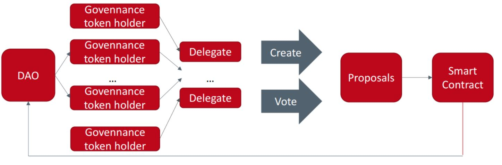

It is usually encapsulated in a set of rules and procedures that regulate conduct of participants in a system. Moving to more decentralized forms of governance, ideally performed on-chain, requires modifying corporate governance processes to fit the idiosyncrasies of blockchains.
In the DeFi and blockchain space, governance, decision-making and operations are typically performed through Decentralized Autonomous Organizations (DAOs).
The BG framework, defining the governance structure of a blockchain as a combination between six governance dimensions, and three governance layers[^19].

{ width="600",height="400",align=center }

#Sovereign_governance

We offer a decentralised autonomous organisation rather than a corporate governance model.
Using only a whitelisted strategy is not enough, and implementing a credential strategy would help with staking as a hybrid governance model. Mitigating the issues with token governance is possible.

#Delegation
token holders may delegate their voting power to more active/informed users. So, this may not exacerbate plutocracy. Because every delegation deserves to active users but not users deactivate.

#Non-token_governance
Proof of humanity (one person, one vote), proof of participation, and proof of contribution have been proposed. Each comes with its own method.

#Accountability
Making voters accountable for the consequences of their actions by imposing penalties and rewards based on the outcome.
  
#Voting_Governance_Model
Governance token holders can delegate their tokens to others (who do not even need to hold GT) to vote.Proposed platform will have the capability to propose (submit MFS Improvement Proposals, or MIPs) and vote.Participants must lock up their MFS (MFS DAO's governance token could called vote escrowed MFS/veMFS) by transferring them from their private wallets(On Polkadot known controller account) to the voting contract (from where they can be later withdrawn). MFS holders can lock their tokens so they can obtain veMFS in order to gain voting and proposal making powers. There is voting power minimum, but a user must have veMFS to create a proposal.
(Imagine, The protocol uses a multi-DAO structure consisting of independent sub-DAOs that, combined, form the protocol governance. MFS holders can vote for changes, but decisions are sent, as a delegated transaction, to the Multisig, which either executes or vetoes the transaction.)