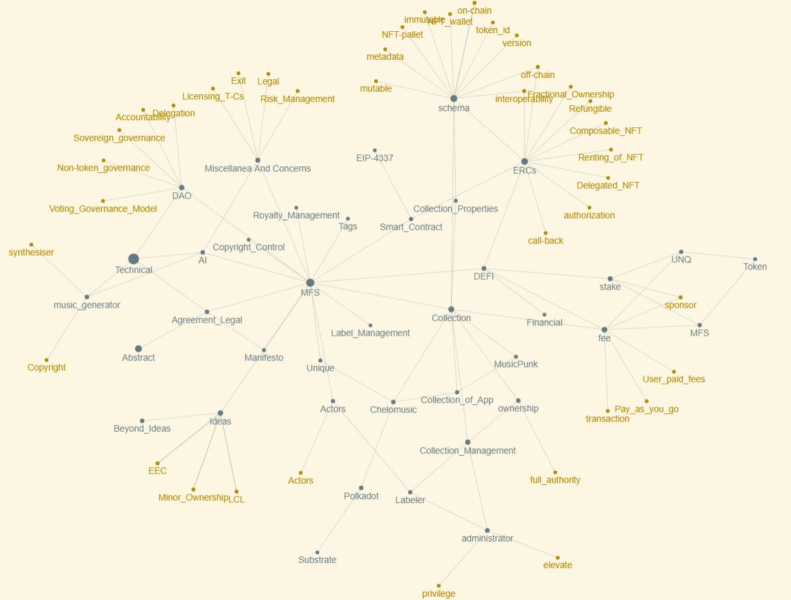

<figure markdown>
{ width="800" height="600" align=center }
<figcaption>Knowledge Graph</figcaption>
</figure>

---

> **MFS: a music NFT decentralized platform**

> *As merry as a mars cricket*

> **Play, Mix, Own, Govern, Earn, Self-releasing, Blanket licensing, Co-Owned, M2E, and Pay as you go TRXs**

---

> NOTICE OF CONFIDENTIALITY([Terms and Conditions](Concern_Legal/Agreement_Legal.md))
Case studies, comparisons, statistics, research, and recommendations are provided “AS IS” and intended for informational purposes only and should not be relied upon for operational, marketing, legal, technical, tax, financial, or other advice. AramisTech . neither makes any warranty or representation as to the completeness or accuracy of the information within this document, nor assumes any liability or responsibility that may result from reliance on such information. The Information contained herein is not intended as investment or legal advice, and readers are encouraged to seek the advice of a competent professional where such advice is required. All of details of papers were registered. The paper that you are reading is not a final version, so it is possible that some sections will have minor changes.

> MFS is the short name of the platform, and it is going to be  mentioned  in the final version of the paper.

---

# Project outline

[TOC]

# Abstract
Nowadays, with the development of technology, we observe an increase in the number of users that use streaming music or podcast services.
Whether you’re a singer, artist, labeler, composer, investor, or simply interested in the blockchain space, there is something new for everyone in the platform. A platform that helps you protect, publish, and monetize your music, while offering transparency and insights on reach, performance, and earnings. The MFS suite of apps consists of various solutions tailored to specific needs. Browse our website to read more about all the features, and feel welcome to register your free account. MFS is the swiss army knife for any music professional.
For the music industry, AI technology is more like a thread than a benefit. e.g., deepfake vocal synthesisers, which make a singer's voice sound like that of a famous artist. Who knows, maybe in the near future we will have a tool called MusicGPT!
At present, there is an opportunity for technology companies and the music industry to avoid repeating past mistakes by considering new technologies, and blockchain is the only solution for making legislation with democracy. 
The proposed work has an engineering journey to reach lucrative revenue streams with non-fungible assets. Unlike any other music distribution platform out there, we also allow our users to distribute music to innovative new outlets. By effortlessly creating NFT collections of your release catalogue, you can enter the world of "Web3", unlock revolutionary ways to engage with fans, and tap into new income streams.

Keywords: NFT, Music, Audio, DApp, Musical sophistication, Active engagement, Blanket licensing

---

# Introduction
A marketplace platform in the intersection of digital talents and defi.
MFS intends to bring blockchain technology to the e-commerce sector. As such, MFS will create the world’s first marketplace that’s built from the ground up for digital assets. Moreover, this marketplace will also provide a portal to the emerging metaverse, empowering individuals to express their digital selves. MFS is uniquely positioned to link track music and digital assets through blockchain technology.
MFS represents a paradigm shift in that it is a single comprehensive platform for all things digital. Specifically, MFS is an NFT marketplace, as well as a community-driven online platform for expression and collaboration.

---

# Problem statement

## Have you heard about the phenomenon of the AI music generator?

This phenomenon has copyright owners rightfully concerned, as AI [music generator](./AI/music_generator.md) outputs are veritable collages of fine-grained sound recording samples[^17].
Therefore, one solution is to establish a blanket licensing apparatus for AI music generator training and output. AI developers—as well as other unforeseen parties looking to use numerous works in the future would have a one-stop shop for securing the rights to any works included under the blanket license. This model has been a longstanding practice in the music publishing industry, which utilizes blanket licensing to grant public performance permissions to various users on behalf of hundreds of thousands of authors[^17].

## Royalty Settlement

Existing streaming services must pay royalties for both digital copy and performance rights,but it is not easy to settle the profits properly that go to artist due to lack of transparency. Due to the difficulty of identification, 25% of the total royalties incurred by streaming services will not be paid[^3].

### Sales Profit
Due to the current distribution structure involving various brokers, the distribution of profits to artists has not been properly paid[^3].

- [ ] High fees for streaming services
Streaming services charge 15-40% of royalties to users in the name of usage fees. Due to the high cost, users refuse to use streaming services and obtain music through other methods such as pirated copies[^3].

- [ ] Geographic difficulties preventing entry into new markets
It is difficult for one singer to enter another country’s market, especially Asian artist’s entry into the American and European markets which is vey rare. Even if the singer is successful in Asian markets, it is hard to guarantee the success in fandom formation by entering new markets[^3].

## Project Vision/Objectives

Our ambition serves personal, collective, and institutional goals:

- [x] Amplify the impact of purpose-driven NFT artists by joining forces to fandom with collective initiatives (shared communication, collaborations, collective exhibitions, etc).
- [x] Create a self-sustainable model for purpose-driven music production / finding an alternative model to the traditional music industry by enabling genuine sustainability.
- [x] Create the first robust online gallery of NFT music playing for the planet.
- [x] Directly support purpose-driven NGOs with sales of donated events and create a new culture of the music supporting purpose-driven projects.
- [x] Establish an ecosystem of Blockchain NFT platform for the fastest way to meet World-Genres in the world without regional restriction.
- [x] Create streaming networks where artists can communicate directly with their fans and easily making profits, and it becomes the most preferred music service-oriented in the world.
- [x] Support the growing aspirations and self-creating activities of artists who are ahead of debut competitors.
- [x] Reduce the broker’s revenue share in the entertainment business revenue structure and build an environment where MFS Token can be used as the best payment method.
- [x] Development and deployment of music LCL, NFT EEC.
- [x] Proposed NFT platform can imitate functions of traditional finance and NFTs.
- [x] Working on roadmap continually.

---

# Background

The advent of blockchain technology is plain for anyone to see. Even those unfamiliar with the underlying technology are becoming aware of the immense interest in cryptocurrencies such as Bitcoin, Ethereum, Binance Coin or others. Cryptocurrencies have come a long way since the publication of the Bitcoin whitepaper in 2008.

Likewise, interest in so-called NFTs (non-fungible tokens) have exploded in recent years. Although NFTs bear a passing resemblance to cryptocurrencies - in that they are digital assets - they differ in that NFTs are non-fungible. Non-fungible means something cannot readily be interchanged or replaced by another of its kind - effectively, it means NFTs are unique. In short, NFTs are unique digital assets that can - through their non-fungible nature.
On the other hand, the e-commerce sector is struggling to cope with the rise of blockchain-based technology. Some still dismiss crypto and NFTs as scams, others view them as buzzwords, and others only see them as short-term cash grabs. All the while, everyone from Forbes to Sotheby's have described NFTs as ”the future of e-commerce”. Still, no one in the e-commerce space has yet to come up with a comprehensive vision for what an ”NFT + e-commerce” platform could look like. Until now.

As people’s communication, transactions and identities shift increasingly towards a digital setting, NFTs provide a crucial link between music ownership of real-world assets and a digital representation of these assets. This is why previously obscure NFT marketplaces are receiving multi-billion dollar valuations left and right. However, even the NFTs on the top NFT marketplaces have a major drawback in that they do not provide any utility to users. This is where MFS comes in.

 MFS provides a link between digital assets and real-world items, with a comprehensive approach to bridging the gap between web 2.0 digital objects and NFT, while also bringing utility to its users.

## Micro-tokenomics

the microeconomics, is a term that refers to the rules and mechanisms of and within a certain blockchain/protocol.It focuses on the individual build-in properties and parameters of a blockchain/protocol and includes:

- [x] Blockchain security model
- [x] Economic security (incentives, game theory, mechanism design)
- [x] Monetary policy (inflation rate, staking, vesting, etc.)
- [x] Token purpose
- [x] Token functionality
- [x] Token utility

## Token Supply
- [x] Initial Token Supply: The circulating tokens when the token starts to be traded on secondary markets (exchanges)
- [x] Circulating Supply: The current number of tokens on the market
- [x] Total Token Supply: The total number of tokens that will ever be minted.
- [x] Unlimited Supply: When the Total Token Supply if not fixed/bounded (e.g. Ether).
- [x] Max Token Supply: The Total Token Supply minus destroyed (burnt) tokens.
- [x] Minted Tokens: The tokens created so far.

## Market capitalization
The total market value of all tokens in circulation (circulating supply multiplied by token price).
- [x] Fully Diluted Market capitalization: The market capitalization if the Max Token Supply was in circulation.
- [x] Inflationary Token: Tokens that do not have or have not reached maximum supply.
- [x] Deflationary Token: Tokens that have reached their maximum supply and their total quantity can only be reduced in the future.

## Streaming Music On Blockchain
The global entertainment market is expected to grow to about $2 trillion by 2021. In 2018, the music streaming market reached nearly $274 million. In addition, 41% of Internet users in Korea have registered for streaming services, and it is far higher than other countries.
Recently, streaming services which increasingly have improved user convenience have emerged as the most accessible segment in the music market today. For groups of artists performing independently, streaming services is becoming a foothold that creating new types of revenue and moving away from geographic constraints to provide a wide range of audiences with their music. The most important thing is that artists also can improve their skills constantly through these services[^3].

## Smart Contract

Smart Contracts have benefits and considerations in three area includes: trade, financial and so on [^8].

#### Benefits
1. Faster approval and payment initiation
2. Automated compliance
3. Monitoring of Letter of Credit conditions
4. Transport-related contract agreements
5. Increased liquidity of financial assets due to ease of transfer and fraud reduction
   
#### Considerations
1. Wider acceptability and adoption
2. Potential smart contract execution fall-out must be determined
3. Integration with settlement systems, off-chain ecosystem

## Non-Fungible

NFTs are created for unlocking new commerce and engagement opportunities with identify the NFT use case.

### Blue-chip NFTs
Blue chip NFTs are projects expected to maintain their value stability and profitability in the long term. 
Common traits shared by blue chip NFTs include historical value, brand power, an experienced team, a strong project roadmap, and an active community. 
Bored Ape Yacht Club, CryptoPunks, Azuki, Doodles, PudgyPenguins, CloneX, VeeFriends, Meebits and Cool Cats are some NFT projects to keep an eye on. 

### Fan Engagement
NFTs can be much more than a collectible or piece of art, and savvy brands are recognizing that the most successful and long-term-relevant NFTs will be ones that have ongoing value and utility. For example, NFTs can better connect fans to their favorite teams or brands by offering voting rights to team decisions, access to exclusive offers, and the ability to earn rewards[^6].

### Customer Relationship Management
Unlike physical goods, NFTs are trackable so it can be possible to see what wallet address they reside in. NFTs can open unique segmentation and engagement strategies based on trackable factors related to the NFTs owned/purchased.This might include the types of NFTs owned, the quantity owned, or the duration they’ve been held[^6].

### New Potential Revenue Streams
Because NFTs enable digital scarcity, brands can sell exclusive, limited digital goods. Unlike physical goods, NFTs can include a smart contract that codes in a royalty percentage designated by the content creator. As such, subsequent sales or auctions of the NFT can generate revenue for the original NFT creator, providing an ongoing potential revenue stream as it is sold or auctioned[^6].

### Collectibles
The digital scarcity that NFTs enable is a natural NFT for collectibles or assets whose value is dependent on there being limited supply. Some of the earliest NFT use cases include CryptoKitties3 and CryptoPunks4 (10,000 unique pixelated characters), with individual CryptoPunk NFTs like Covid Alien selling for $11.75 million5. More recently, popular brands are creating NFT-based collectibles, like NBA Top Shot moments, which are digital basketball cards, but instead of static images, these NFTs contain video highlight moments from NBA games[^6].

### Art
NFTs enable artists to sell their work in its natural form factor as opposed to having to print and sell pieces of art. Additionally, unlike with physical art, the artist can receive revenue upon secondary sales or auctions, thereby ensuring they are recognized for their original creations in subsequent transactions. NFT marketplaces devoted to art-based NFTs, such as Nifty Gateway, sold/auctioned over $100M of digital art in March 2021[^6].

### Re-fungible and Fungible Modes
Re-fungibility is an important step towards building real life models of ownership rights. Often a unique item may be owned by multiple entities in different proportions. The examples of such shared ownership are abundant: Timeshares, co-ownership of art, fractional car ownership, etc. For that purpose Unique Network provides the special mode of Collection: Re-Fungible. The Re-fungible token can be minted and then partially transferred to multiple owners.  
Fungible collection mode is targeted at the same set of use cases as ERC-20 tokens: Any non-unique and divisible resource can be represented as a Fungible token. While these use cases are not the prime focus of Unique Network, many applications need this functionality in parallel to the NFT the examples include: Non-unique game resources (such as game money),rating points in applications with social networking capabilities, voting tokens, etc.[^1].

## Consensus and Tokenomics
The Unique Network use the Relay chain consensus, as any Polkadot parachain does, and off-chain mechanisms for Collator incentivization, which is important for decentralization, prevention of censorship attack [26], and improving the user experience due to reducing node latency for client responses[^1].

## Market place

In recent years, the NFT markets have become a vast virtual marketplace offering digital art and collectibles in every price range imaginable. The promise of NFTs is growing in digital art, music, graphics, films, and other art forms. NFTs offer unique potential to cut out middlemen and intermediaries, simplify transactions, and reach consumers in new geographies. One of the most notable examples of such an application was NBA Top Shot. The NBA released NFTs that allowed fans to immortalize their favorite star
moment in the form of a card. These cards created a lot of hype and led to millions of dollars in NFT sales worldwide.

Demand for digital art via NFT token systems continues to grow. For example, Beeple, a digital artist, sold his art at Christie's for $69.3 million as an NFT sale. The NFT artwork was a set of 5,000 images that could be viewed online for free. The growing demand for digital art online and the increasing interest in niche categories of digital graphics, such as memes, promise great growth for NFTs in the near future. Furthermore, the entry of large companies such as Visa, Nike, Microsoft, Home Depot, and Starbucks remains a key driver of growth.

### E-Commerce Marketplace

MFS’s e-commerce marketplace for traditional music products, or merch, will be found on the same Marketplace tab as MFS’s NFT marketplace. This is a conscious decision, as we believe all online sales - physical and digital - will one day live side-by-side. As MFS offers deep integration between album (merch) and their digital counterparts (NFTs), having both of these share the same marketplace makes a lot of sense.
Specifically, when purchasing album merch through MFS, the consumer will also receive a digital representation of the merch they’ve purchased. For example, users will be able to customize their digital MFS avatar with the digital NFT representations of the album merch they buy through MFS’s e-commerce marketplace.
Furthermore, just like on the NFT Marketplace side of things, MFS’s e-commerce marketplace will also be open to other brands. MFS will also provide their own clothes through the marketplace, and the community will be heavily involved in choosing upcoming merch drops through voting with their GOV tokens.

## DAO
It is usually encapsulated in a set of rules and procedures that regulate conduct of participants in a system. Moving to more decentralized forms of governance, ideally performed on-chain, requires modifying corporate governance processes to fit the idiosyncrasies of blockchains.
In the DeFi and blockchain space, governance, decision-making and operations are typically performed through [DAOs](./DAO/DAO.md).
The BG framework, defining the governance structure of a blockchain as a combination between six governance dimensions, and three governance layers[^19].

<figure markdown>
{ width="600" height="500" align=center }
<figcaption>Fig 1. DAO[15]</figcaption>
</figure>

## Royalty Management

### When I buy music rights through Royal, what do I get?
When you invest in songs or albums on [Royal](./Royalty_Management/Royalty_Management.md), you get a token representing a percentage of the music’s streaming rights, plus extras. You earn royalties alongside the artist and get paid when they do.
Artists choose what percentage of the song's royalties to drop. They can also attach extras like fan experiences, exclusive tracks, merch, and more—it's all up to them[^4].
### How do I buy a token during a drop?
During a drop, you can buy a token through Royal’s website with a credit card. Before you buy, you’ll be able to see the percentage of ownership per token tier, the extras attached, and information about pricing[^4].
### If you get a token during a drop, it will appear on your Royal dashboard. Missed out on a drop? 
You can buy a token on our music rights marketplace.
Create a free Royal account to receive email notifications about upcoming drops. You can also follow us on social media to keep up with the latest releases[^4].
### How do I claim streaming royalties?
Once you buy a token, your royalties start accruing as the song, EP, or album streams on platforms like Spotify and Apple Music.
You get paid your portion of the royalties when the artist gets paid. The time to payout will vary depending on the artist—on average, payouts happen every 6 months—and we’ll notify you when royalties become available to claim.
Once available, you’ll claim your royalties in your Royal dashboard by transferring funds to another crypto wallet[^4].

### Can I sell my token?
Yes, you can list your token for sale any time on royal.
One exciting part of purchasing music rights is that these assets may appreciate—artist and song popularity, token demand, extras, and more can all play a role in secondary pricing.
Once you sell your token, royalty payouts and unclaimed extras will go to the new token owner[^4].

Royalty advances are essential to musicians because they provide a source of upfront income before the actual royalties from music sales and streams start coming in. This can be particularly useful for musicians who are just starting out, or for established musicians who need financial support to produce new music, pay for promotional activities, or cover living expenses[^2].
A royalty advance is similar to a loan that a record label or publishing company provides to a musician, based on their expected future earnings from music sales and streams. The advance is then recouped from the artist's future royalties. In other words, the artist repays the advance by dedicating a portion of their future earnings to the lender[^2].

## Label Management

[Label Services](Label_Management/Label_Management.md) are a fundamental building block of our more robust peer-to-peer platform. This deployment will give access to creative services, playlist pitching, PR services, and advertising for artists and labels on the platform[^2].
It is our intention to build this within Circle’s USDC ecosystem. The advantages of using USDC to transact include removing volatility for crypto payments, allows Unchained Music to accept Credit, Debit, Bank Transfers, and Bank Wires, and hedges against potential stablecoin regulation in the United States by working with the most reputable company issuing a centralized stablecoin today[^2].
Future iterations of the label services platform will allow the Unchained Music token to be used for discounts on these services.[^2]
During this initial deployment we will start to deploy our V1 smart-contracts, which will be built with the intention to allow other service providers, musicians, and other creatives to operate within the peer-to-peer platform upon launch in 2024.[^2]

## Properties

### Metadata Schemas
One important property of a collection is the Off-chain [Schema](Collection_Properties/schema.md). This schema describes the metadata that is associated with each token and can be accessed by the token ID. It can be an image or a more complex and structured data. For additional protection of token authenticity, the off-chain metadata hash can be recorded in the immutable token metadata. Besides the off-chain schema, it is possible to set the similar schemas for mutable and immutable NFT metadata that are stored on-chain. The main purpose of the off-chain and on-chain schemas is allowing the standardised definition of application specific token data[^1]. 
Standardization is important in order to set the grounds for interoperability between multiple chains, but also is flexibility. Unique Network sets the goal to support many standards to stay interoperable and at the same time flexible enough to accommodate new schema standards as they appear. Thus, the Network does not restrict the schema to any format, but allows to select the format out of existing known standards to the moment: ERC-721, OpenSea, or Tezos. The NFT wallets will be able to read the schema version that is stored on-chain and display the NFTs appropriately[^1]. 

### White Lists
Depending on the application design and requirements, the collection may be accessible for a wide audience or for a restricted and private group of accounts. In the latter case, a white list access mode may be enabled to restrict capabilities of owning and transferring tokens by only accounts included in the white list[^1].

### Private and Public Minting
The Collection owner may choose to allow non-privileged users to mint tokens in their collection by enabling the public minting mode. Combined with the White Lists, this could be a powerful tool for applications that require their users to be able to create their own tokens, such as art galleries, some games or applications for collectors[^1].

## Comparison of platforms
Each marketplace differs in pricing, niche, market size, supported file formats, search options and platform design. Most marketplaces are very technical and have poor UI/UX. To build a successful marketplace, it needs to be more than just a platform for transactions. It needs effective, thorough technical preparation and of course a high quality UI / UX design. MFS aims to achieve this.

[Appendix](https://armanriazi.github.io/mfs/Whitepaper/#appendix "jump to the appendix")

### Unique Token
Unique Token is the Unique Network token that is used for several purposes[^1]:

1. Transaction rate limiting and DDoS protection in form of transaction fees.
2. Network Services
3. Application data storage rent
4. Advanced features of the network
6. In-app payments through payable smart contract methods
7. App promotion program
8. Paid Rate Limits

## Ownership

The application developer would create the collection and become its owner. [Ownership](Collection_Management/ownership.md) of collection means the full authority over all of its properties and NFTs, including the capacity to destroy the tokens and the collection or give up this authority by transferring the ownership to an address with an unknown private key[^1].

### Operating NFTs
Once the collection is created, its owner can mint tokens that belong to this collection. The minting process is an atomic operation of creating an NFT item, setting this item’s immutable metadata and its owner[^1].

## Standards

The Interchain NFT and Metadata Standardization conducted extensive research of NFT token and their Metadata standards. Unique Network aims to comply with this interchain standard and deliver the network protocol that is applicable to and able to describe a wide range of NFT formats known in order to prewire the NFT interoperability for most if not all known NFT standards, which is explained in detail further[^1].

## Interoperability

Another important feature for existing Ethereum users will be emulation of ERC-721, ERC-20, and other Ethereum standards through RPC calls. These RPC endpoints will enable transparent use of native Unique Network capabilities in Ethereum tools in the same manner as Frontier, i.e. Metamask, Truffle, Web3 libraries, etc. The dApp developers and publishers will be able to seamlessly convert their user bases to Unique with zero learning curve for their users[^1].
Furthermore, the off-chain service can be an additional factor that limits the performance. For off-chain integration, the REST API can be utilized to pass the data to be computed to the outside. However, the REST API will also have certain limitations from a performance perspective.Therefore, alternative integration techniques such as gRPC can be used[^10].

## Fee

Unique Network is going to offer several gas [fee](/DEFI/fee.md) models for its users in order to provide as much flexibility as possible to adapt to miscellaneous marketing strategies of application developers and remove UX friction for the newcomers.
The gas fee model is configured separately for each Collection or a smart contract. Every Collection and smart contract has a fee model assigned to it, which determines how its transactions are paid, and the developer can choose the fee model that better suits their application[^1].
Initially the fee model is configured to a default one and can be updated later at any time and as many times as needed.Currently there are two models implemented: The default “User paid fees” model when the transaction sender pays all gas fees, and the “Pay as you go” model when collection or smart contract owners enable sponsoring for certain transaction types for their users[^1].

### Layers
1.  Off-chain community
2.  Off-chain development
3.  On-chain protocol
   
### Dimensions
1.  Roles
2.  Incentives
3.  Membership
4.  Communication
5.  Decision Making
6.  Format and Context
   
---

# Solution

MFS is a platform that’s built from the ground-up to natively support both traditional e-commerce and digital assets like NFTs. What’s more, MFS will feature its own native cryptocurrency - MFS token - that powers the platform and Thus, MFS is designed to be as frictionless and accessible as possible towards casual visitors.
However, if visitors decide to also use MFS’s blockchain-based functionality, they will get access to a wealth of blockchain-based features. For example, they will receive micro-rewards in MFS’s native token, MFS token, for interacting with the site. Moreover, they will also be able to receive NFTs and store these in their connected wallet.

Most importantly, MFS represents the first thought-out vision of a platform that natively supports a musical NFT digital assets in marketplace, and a cryptocurrency-powered community - all working in tandem.
Specifically, those who understand the potential of blockchain technology are generally not market-facing enough to realize the massive business potential and potential synergies between traditional e-commerce and digital assets. Right now, most NFT marketplaces are ”for techies, by techies”, and hard to navigate for common people. Still, even these hard-to-use NFT marketplaces are valued at billions of dollars. Conversely, those with the business skills to bring a project like MFS to market generally lack the technical insight needed to realize that it is even possible.
Now, however, the time is ripe to realize the MFS platform. Whereas the technical landscape has previously been too immature to support a resource-effective launch of a platform like MFS, it is now possible.

## Core Business

`Business Areas`
-   Music production, artist management & marketing, record label management, copyright control

`Music Business`
-   Album, digital music, concerts & performances, events, advertising, merchandising, royalty management, auction

`Media Production`
-   Concert production & operation, playlist, fandom channel

> The Successful Factor of Entertainment Business:

`Artists`
-   Need a competitive celebrity with talent

`Marketing & Plan`
-   Frequent exposure on partnerships of platform, the press, social media, and other media
-   Create albums to meet current music trends

`Producing`
-    Produce sound sources with high-quality and popular music preference.

`Fandom`
-   Form a fandom culture that can increase the artist’s brand awareness.
-   Encourage fans to spread the message that ‘the artist is popular.

> The core functionality of the exchange would be implemented in asset layer and in the protocol layer of the DeFi stack.

## Actors 

- [x] Singers
- [x] Songwriters 
- [x] Record labels
- [x] Publishers 
- [x] Artist managers
- [x] Digital content creators 
- [x] Web2.0 accounts

## Building a relationship between artists and fans
A&R mint a podcast or singer practices what it promotes and issues free NFTs to its fans as a way to reward its loyal listeners, grow its audience and generate excitement. Issue free NFTs to get new listeners to make a ripple effect.

## Progress Phases

### Initiating

- [x] Support rights and intellectual properties.
- [x] Read helpers and FAQ section of the platform.

### [Planning]

- [x] Making a plan by A&R (single producer doesn't need this step)
- [x] DAO A&R-oriented
  
### Executing

1. Record & producing by a singer, [mixer & masters], [LCL] of the platform.
2. Making a plan by A&R
3. Mint free NFTs
4. [Presale]
5. Mint track/album NFT

### Monitoring and controlling

1. Filter & Search
2. Promotion
3. Management
4. Monitor

### Closing

- [x] Transfer NFTs to wallet
- [x] Fandom channel
- [x] DAO investment-oriented
- [x] Utilizing actors' earnings are determined in some way by the defi mechanisms of the platform.

## Strategy for Launching a Token
Identify a pain point and how you are going to solve it.
1.  Clearly articulate why a token is especially integral for your solution
2.  Cultivate a community of people around that pain point, and understand the incentives they face and what rewards are likely to be more motivating for them (e.g., create user stories)
3.  Create those incentives and embed them into the ecosystem design
4.  Enumerate the broader supply/demand factors that influence your token
5.  Establish the distribution of tokens and the treasury supply of it, and explain it in a whitepaper

## Designing Airdrops

Airdrops have proven to be effective, on average, when done with governance tokens, but how effective really depends on implementation.

- [x] Think about eligibility requirements carefully - you don't want to necessarily make it available for anyone, otherwise you are not doing anything to attract the users who are most likely to value it
- [x] Embed utility and governance - there are already too many useless tokens that only trade on the expectation of higher future prices, but tokens with value actually carry some utility and/or governance rights
- [x] Consider the role of vesting and staking - sometimes you may want recipients to have held or staked tokens for a certain duration of time before they can trade, so integrate the airdrop with other organizational strategy
- [x] Leverage psychology - people like getting things for free, so build on that reality so that recipients really feel like they're getting a reward.

## Safe digital assets in a long-term sustainable way
The frontend UI hosted on IPFS. It consists of several pages powered by ReactJS. There is an integrate with NFT Chain by means of Polkado{.js} browser extension, metamask and PolkadotJS API.
DApp supports Web3 wallets so users can lend and borrow founds directly through their UI.
Unique and Polkadot.js are easy-to-use wallet that are perfect for non-technical audiences who are storing assets, who love our white-label solution.

## Collection

- [x] MusicPunks NFT collection created in NFT Pallet with 1000 minted NFTs. Each NFT has the MFS ID and on-chain properties that determine the look of the character.
      
- [x] Matcher smart contract that stores current market state and matches incoming bids from the UI against existing ask offers. This contract is written with Rust.

### Management
It is hard to overestimate the importance of Ownership in human society. Ownership defines the exclusive rights and control over the property. Thus property, ownership, and rights are one of the most important mankind essentials. It is important for one’s solid realization of the universe to build a correct and precise model of ownership and rights.
Another important right that collection ownership gives is [administrator](Collection_Management/administrator.md) who is would be labeler. An administrator of collection is the account that has elevated privileges over common users, but slightly less than a collection owner. As such, only the collection owner can destroy the collection and add administrators. This permission level was mainly aimed to allow automated operations over collections, such as minting tokens on demand. Also, a [smart contract](/Smart_Contract/smartcontract.md) can serve as a collection administrator to allow advanced decentralized application logic such as Claiming free [MusicPunks](/Collection_of_App/MusicPunk.md) , for example.

## Mint the NFTs
MFS flexes the sustainability known with underlying Unique framework— a NPOS network with a much lower carbon footprint than Ethereum. You can mint NFTs without worrying about impacting the environment, and focus more on your finished product. Unleash your creativity, build the next-gen NFT ecosystems in a way that are climate friendly!
the NFT pallet allows storing the NFT metadata in order to allow more authentic definitions of NFT items, while staying agnostic of this metadata format. The Substrate framework provides a robust and flexible WebSocket API allowing connections to the Blockchain to be established by its clients: NFT wallets, Marketplaces, and other programs.
On MFS DApp, creating NFT collections is easy, free, and secure, without ever needing to write a single line of code! We give you the option to mint any digital asset, and both owners and administrators can manage collections.
Burn MFS token-> Mint NFT

## Payments

MFS will list all prices in fiat currencies (such as US dollars, euros, pounds sterling etc. depending on country) and unique network. This differs from some NFT platforms, which generally list prices only in cryptocurrencies. Nevertheless, listing prices in fiat currencies is more familiar for the masses, and lowers the barriers to entry. Despite this, however, MFS will accept payments in cryptocurrencies, including MFS’s own MFS token. This will provide payment utility for the token right on the MFS platform. Moreover, paying in MFS tokens will entitle users to discounts, as it ties them deeper into the MFS ecosystem. MFS users that pay will receive kickbacks in MFS tokens.

## Marketplace
The type of the marketplace is a crypto native curated marketplaces that require contributors to be approved to create NFTs and sell them on the platform. Similar to the open marketplaces, they require cryptocurrencies for payment, and have consumers custody the assets themselves.
You don’t need to have deep blockchain knowledge to understand, build and enjoy our NFT, which allows for the safe and trustless exchange of NFT or RFT assets, sponsored transaction fees, subscriptions, and scheduled transactions.

What does this mean? Most current NFT marketplaces are plagued by subpar UI, UX, and unintuitive site navigation. This is primarily due to the fact that NFT marketplaces have, so far, been designed with early adopters in mind. Not only does this poor user experience erode trust among potential users, it also provides unnecessary friction to the NFT market as a whole. Now, however, as adoption of NFTs begin to move into the mainstream, mainstream consumers expect a very different user experience. This is
where MFS comes in.
Consequently, MFS will not be designed for crypto enthusiasts, early adopters or pro-users, but for ordinary people. Buying an NFT using MFS should not be harder than buying a t-shirt online.
Another crucial difference between MFS and other NFT marketplaces is that MFS will have a built-in curation system for NFTs. This curation system will ensure that the MFS NFT marketplace isn’t flooded by low-quality NFTs.

The opportunities for the NFTs released by MFS are virtually endless. For example, these could give holders access to special loyalty programs, increase the holders’ MFS token micro-rewards, and more. NFTs can take many different forms as well - from ”digital art” and digital representations of digital music assets, to music and much more. Moreover, the fact that MFS’s NFTs are based on unique network means they are ”future-proof”, and they have the promise of utility. MFS are going to include a “resale royalty” attached to MFS NFTs, meaning MFS will continue to receive a kickback every time the NFTs are sold.

###	NFT Marketplace Competitor Analysis

The NFT market is a competitive, innovative, and fragmented landscape. Incumbent players in the NFT market continue to lead the way, with an increased focus on value proposition and platform advantages. Growing demand for NFTs and increasing applications remain the key growth drivers for the NFT market. Below are descriptions and comparisons of five(5) of the major NFT marketplaces.

##### OpenSea
OpenSea is the world's largest marketplace for NFTs and has been in existence since 2017. The platform has the largest number of registered creators and is also considered the top choice for NFT launches. The commission charged by OpenSea is 2.5% of sales.

- [x] Pros: Largest market, longest history, many supported formats.
- [ ] Cons: Too many creators and hard to get discovered as an artist. Poor UX, difficult to find what you are looking for.

#### Rarible
The distinguishing feature of Rarible is its own token "RARI". This can be used not only to sell or buy NFTs on the platform, but also to suggest or vote on enhancement proposals, moderate community members, curate special artworks, and promote members by suggesting community or art grants. An initial fee is required for the contract gas fee and also separate minting and listing fees each time a creator lists their work. The commission that Rarible charges is 2.5% of sales.

- [x] Pros: Large market, original RARI tokens.
- [ ] Cons: Expensive and multiple gas payments required. Messy UI.

#### SuperRare
SuperRare is an exclusive NFT platform that was launched in 2018. SuperRare is a
marketplace focused on unique digital artwork in single editions. SuperRare is currently working with a small number of hand-picked artists. For this reason, SuperRare is "beyond premium." SuperRare charges buyers a 3% commission and artists a 15% commission per NFT sale.

- [x] Pros: Super Premium, hand-picked artists.
- [ ] Cons: Very difficult to join. Slow loading and poor UI.

#### Nifty Gateway
Nifty Gateway is historically one of the most well-known NFT marketplaces, with some big names like Beeple, Michael Kagan, Calvin Harris and Deadmau5 pioneering the NFT culture. As with other exclusive platforms, you must apply through the invitation form to receive an invite as a creator and go through the audition process. Nifty Gateway’s service fee has recently been increased to 20%.

- [x] Pros: Super Premium.
- [ ] Cons: Very difficult to join. Poor UI/UX.

### NFT Marketplace - Other Brands

What’s more, MFS’s NFT marketplace will also be open as a testing ground for other brands. Specifically, brands that do not yet have a working ”NFT +e-commerce'' solution themselves will be able to approach MFS for exposure on the MFS platform. As such, they will be able to drop merchandise and NFTs, with MFS providing the necessary tools to link them. The lack of other technical solutions with the ”NFT + e-commerce'' capabilities will drive high-profile brands to collaborate with MFS. Also, interest in releasing NFTs has never been higher.MFS allows other brands to dip their toes into the NFT market, without them having to spend months developing their own technical platforms.
Since collaborations like these are a large potential market on their own, MFS will have an easy ”plug-and-play” solution ready to allow other brands to launch their own NFT + merch drops on MFS.

## Community

The community will be an essential part in building the MFS platform. MFS is built for the community and intends to involve the wider community as much as possible. This is evident through the extensive use of community-driven governance through the GOV tokens, MFS’s reliance on ”prosumption” as a key differentiator and value driver, as well as the extensive use of micro-rewards and gamification to engage the community.

What’s more, MFS intends to employ a broad strategy in working with the community to drive interaction and awareness of MFS. This includes distributing video content over YouTube Shorts, Instagram Reels, Twitch, and TikTok, in an effort to foster a following, under the moniker Music337Punks.

Currently, the crypto and gaming market lacks a clothing brand that truly appeals to their communities. There’s a need for a brand that integrates the wider movement that cryptocurrency belongs to. MFS will shake up this segment, with an authentic brand that speaks to the crypto community, as well as the gaming community. The team behind MFS has extensive experience building brands in the retail industry. We firmly believe that with our first mover advantage, we can position MFS as the premier apparel provider for the crypto and gaming community.

Surprisingly, in an industry that revolves around deep tech, blockchain projects still rely heavily on word-of-mouth to become known. By putting a comprehensive
 
community-focus on developing its platform, MFS will be pushing the envelope for what a brand can be. Specifically, MFS will employ a governance model that ensures MFS develops in accordance with the users’ wishes. MFS will reward community power-users with governance tokens, which allow the community to vote on decisions, and help decide how development should proceed, and what the next partnership or collaboration should look like.

Truly engaged communities are also the best advocates on social media channels and beyond. We at MFS believe this kind of organic support is essential. Active communities encourage new member engagement by explaining and informing the community, as well as answering questions on social channels. Well-informed members who lead community engagement will create a positive feedback loop, as they increase community understanding and support.

MFS recognizes these benefits and will be implementing a number of community rewards programs and development initiatives that will allow members to earn tokens or prizes for their social media engagement. MFS’s
“micro-rewards” will be key in this, as they drive interaction with the platform. These are important exercises to ensure the community feels valued and engaged. The
relationship must be mutually beneficial and, more importantly, based on open and honest communication.
 
## Prosumption

Prosumption - an amalgam of the words ”production” and ”consumption” - is one of the latest trends in producing brand-value and building compelling platforms. Put simply, prosumption is when consumers of a platform partake in the actual production and creation of the goods they intend to consume - becoming prosumers, rather than mere consumers. Prosumption can be described as a gamified way to facilitate co-creation, which benefits both consumers and the company involved. Consumers become inherently more invested in the arena that facilitates this co-creation.

Prosumption is a central theme for MFS. MFS will leverage its GOV tokens and governance system to enable extensive co-creation and
community-driven innovation. For example, users with GOV tokens will be able to vote on upcoming clothes, merchandise, NFT collections, and much more. In fact, users will be able to create their own NFTs and put these up for a vote among the MFS community. If other users approve of the NFT, as outlined in Section 4.3.1, the NFT will be able to be bought or sold on MFS’s marketplace.
Furthermore, the creators of such NFTs will also receive a kickback of each sale.
This productivizes the MFS community, as our users will be able to independently create, verify and advertise the products that are listed on the MFS marketplace. This is a telling example of the sort of prosumption that will “weaponize” MFS’s community and make them an integral part of the MFS ecosystem. Allowing users to create their own products through MFS and to potentially sell them to others will create a sense of pride among these “prosumers. Furthermore, by incentivizing them to market their products themselves creates an excellent opportunity for exposure to MFS.

### Prosumption Votes
MFS users will be able to ”level up” based on their interaction with the site. This comes as a complement to site-wide micro-rewards. The MFS platform
 
will have 337 levels, and it will follow the standard ”game model” of levels where it is progressively harder to level up. As such, it might take a user an hour to go from Level 1 to Level 10, but it will take significantly more to go from Level 200 to Level 210. What’s more, these levels will also serve a purpose as users get various rewards when leveling up. Perhaps most notably, this is how users will be able to earn GOV tokens.

- [x] Level 37 - Users receive their first GOV token
- [x] Level 137 - Users receive their second GOV token
- [x] Level 237 - Users receive their third GOV token
- [x] Level 337 - Users receive their fourth and final GOV token

Additionally, MFS will employ a recognizable ”MFS avatar”, which users can customize themselves. As such, each user will be able to customize their avatar with the use of their NFTs. This will function as a proof-of-concept of MFS NFTs’ utility. For example, users will be able to dress up their avatar using the digital NFT of the merch they’ve purchased.
 

## Ticketing
In addition to being collectables, NFTs can be combined with event tickets to provide access to an event. These tickets can provide verifiable authenticity, provide royalties upon secondary sales or auctions, and even turn digital tickets into unique commemorative assets.

## Properties
#### Private and Public Minting
DApp has inherited only public minting and creating an optional whitelist for A&R to make limitations based on location, genres, sex, and age. In addition, allowing the following schemas.

---

## The next phase of digitizing art assets

### Benefits
- [x] Ease of use. Tokens are trivially created, stored, traded
- [x] Fractional Ownership. Think of the prohibitively expensive music track in the concert or NFTs such as MusicPunks.
- [x] Tokenization allows investors to own fractions of the asset. Accessibility. Again, think of the volume of transactions in music marke, versus the volume of transactions in NFTs or crypto.
- [x] Market efficiency. Tokenization may smooth out boom-and-bust cycles of illiquid markets by making them more liquid and organized.

### Challenges
- [x] Generally, not decentralized: intermediaries will ALWAYS be needed for non-native assets.
- [x] Legal recognition

## Marketing

MFS is by the people for the people and we want to be the epicenter of the Crypto Revolution. We have a first mover advantage in this new paradigm. Our core marketing plan is to work closely with influencers, brands, teams, etc in several different fields. With MFS’s NFT Marketplace, influencers can monetize their communities. In time, everyone needs to be present in the digital properties metaverse arena.
Imagine influencers not using the internet or bands not being on Spotify. It's not only about creating new revenue streams or growing fame or their fanbase, it's about staying relevant. MFS bridges the gap between traditional e-commerce and the Metaverse, a term that describes an emerging shared digital space that can exist without interference. It is a new, value-driven internet, collectively run by its users, with a focus on community co-creation through prosumption.

Influencers and partners are key ingredients to grow the MFS brand. We will carefully select the best influencers to collaborate with. These include top global talents in everything from street art, professional e-sport profiles, extreme sport athletes,
musicians, comedians and much more. By cross-promotion we tap into each other's fanbase to grow as fast as possible. Influencers will help build credibility for the MFS brand in the beginning, but as we move forward, we want them to strive to be associated with us.

Each collaboration is different, and we will refine and tailor our offering as we learn more about their different needs.

MFSS value proposition for influencers includes:
- [x] MFS tokens
- [x] Early adopter advantage
- [x] Additional revenue streams including recurring revenue from secondary sales
- [x] Create a stronger brand
- [x] Limited collections
- [x] Collaborations and partnerships
- [x] Digital scarcity
- [x] A more effective way of monetizing their art/content
- [x] Auction contribute, including minting and distribution
- [x] Grow their fanbase/followers by gaining access to MFSS community which includes the fans of other influencers
- [x] Cross-promotion marketing
 
##	Campaigns

MFS will not have any discount campaigns. Instead, user interaction on dates like Black Friday will be driven by special MFS token kickback events. For example, purchases on dates like Black Friday could have “3x” MFS token kickbacks. What’s more, users that purchase MFS items during special periods or dates will compete to win special NFTs.
These token-driven campaign strategies allow MFS to increase interaction without lowering prices. As such, MFS prices will not be eroded by seasonal discounts. Instead, MFS products, and digital assets, will always sell for list prices. This means MFS can effectively leverage MFS tokens and its prosumption business model to escape the discount trap.

## Tokenization
MFS will mint and sell standalone in-house NFTs (non-fungible tokens) under the MFS brand. MFS will collaborate with various designers and artists for these NFT releases. As such, MFS will be able to do partnerships with artists, influencers, or even brands for certain in-house NFT drops under the MFS NFTs label. Consequently, MFS will facilitate NFT drops for other high-profile artists and brands, which in turn will help boost awareness of MFS as NFT creators help promote the MFS NFTs they’ve helped create. In addition to this, MFS will also release NFTs developed by in-house designers under the MFS NFT brand.

The MFS NFT brand will give MFS the flexibility to participate fully in the rapidly growing NFT industry. The MFS NFT brand will only be used for digital assets, i.e. NFTs released by MFS.

What’s more, MFS does not only have the technology to create a comprehensive NFT and e-commerce platform, but also the team and the timing.
> MFS has the technology, the team, and the timing.
 
MFS will make use of its own cryptocurrency to power all micro-rewards on the site and to help build the MFS ecosystem. This cryptocurrency (”MFS Token”) will be based on the well-known unique network-based technical token standard. Polkadot is the most popular and most widely supported smart contract blockchain in the world. Seeing as MFS’s MFS tokens are, therefore, effectively based on unique network, this means that MFS tokens will be future-proof. For example, it makes creation of the actual MFS tokens extremely easy. Furthermore, many of the larger blockchains are compatible with Polkadot,Ethereum and the ERC-standards which also makes it portable.

There will be several ways to acquire MFS tokens. First of all, MFS tokens will be available for sale through the MFS platform and various exchanges following the MFS Token Initial DEX Offering (IDO). The exact timing of the MFS token ICO will be decided based on market sentiment and promotional potential, but does not pose any technical challenges. The main reason behind launching the MFS token through an ICO is the associated publicity and buzz that can help accelerate public awareness of MFS and its mission to bridge digital. Moreover, users will be able to earn MFS tokens when using the MFS platform, in the form of micro-rewards. These micro-rewards are an important aspect of the MFS platform, as they help incentivize users to use it. 

### MFS Token Benefits
The goal of MFS Token is to become a cryptocurrency that can be used in various ways, including defi, concerts, events, and every kind of future purchases. The MFS looks forward to achieving this vision with unique apps and token plan that make a huge difference in token trading and distribution. MFS Token enables music and album sales in the new market through instant payment and Blockchain-based streaming service as well as promotions, and it will bring innovation to the market. To achieve this vision, the MFS will promote the project through various media and continue steady marketing activities.

## Sponsoring scenario
Artists need to produce/promote their work, go on tour. Financing options are limited with loans (Debt).

1.  Alice(as labeler or A&R) is a promising musician,songwriter or a singer at her early famous stages.
2.  She needs $100,000 for equipment, practice, training, traveling to go local concert.
3.  She signs up at the platform, builds her profile, signs a smart contract with the platform and then 100,000 tokens (each valued at $1) are issued.
4.  Tokens are sold to investors. Alice receives $100K, while investors get the rights to 30% of her future income for a fixed period.
5.  Alice invests the funds on professional practicing and participation in events around the world.
6.  After a few years, Alice has developed into a professional player earning $300,000 a year.
7.  Of this income, 30% (i.e. $90K annually) is distributed to token holders via the NFT platform.
8.  Investors receive income (dividends) and can sell tokens, which will fluctuate in value according to income/maturity.

## Sovereign and governance
Decide how to keep safe actors in a long-term sustainable way.
The MFS platform will make extensive use of a so-called ”governance token”. In essence, governance tokens grant their holders ”voting power” over a specific project. MFS’s governance token (”GOV token” for short) will allow its holders to vote on future features of the MFS platform and to partake in crowdsourced decisions over the platform’s future.

A central aspect of this is that MFS’s GOV tokens will not be for sale. Instead, governance tokens can only be earned through interaction with the platform. As such, this guarantees that only those who are actively using MFS will be able to earn GOV tokens. Unlike MFS tokens, GOV tokens will be relatively scarce and cannot be bought, sold or given away. This mechanism ensures that individual actors cannot simply ”buy” the right to vote on MFS decisions. Instead, the ones who vote on MFS projects using GOV tokens will be those users who have interacted the most with the MFS platform.

Consequently, this makes sure that any crowdsourced decisions taken by GOV token holders will automatically be aligned with the most active part of the MFS community. As GOV tokens are not listed on any exchange, and subsequently don’t have any specific denoted value, it is also possible to revoke holders’ GOV tokens in the event of prolonged inactivity. For example, if a GOV token holder does not log in to MFS for 6 months, the holder’s GOV token(s) will be revoked. This ensures that only active MFS members have access to these exclusive voting rights, and prevents the voting power over the platform from being ”zombie-driven” by inactive members.

Moreover, GOV token holders will not have voting power over day-to-day business decisions. Instead, the role of GOV token holders will be to inform decisions over how to further develop the MFS platform, what new features to incorporate, what new merchandise to add to the site, or which new NFTs to list. As such, the GOV tokens will function as an extra reward for ”pro” MFS power users.

### Voting Governance Model
Governance token holders can delegate their tokens to others (who do not even need to hold GT) to vote.Proposed platform will have the capability to propose (submit MFS Improvement Proposals, or MIPs) and vote.Participants must lock up their MFS (MFS DAO's governance token could called vote escrowed MFS/veMFS) by transferring them from their private wallets(On Polkadot known controller account) to the voting contract (from where they can be later withdrawn). MFS holders can lock their tokens so they can obtain veMFS in order to gain voting and proposal making powers. There is voting power minimum, but a user must have veMFS to create a proposal.
(Imagine, The protocol uses a multi-DAO structure consisting of independent sub-DAOs that, combined, form the protocol governance. MFS holders can vote for changes, but decisions are sent, as a delegated transaction, to the Multisig, which either executes or vetoes the transaction.)

### DAO & Governance Tokens
Allowing collective ownership & decision making of proposed protocol. Only governance token holders can submit and vote on protocol governance.
We offer a decentralized autonomous organization([DAO](./DAO/DAO.md)) rather than a corporate governance model.
Using only a whitelisted strategy is not enough, and implementing a credential strategy would help with staking as a hybrid governance model. Mitigating the issues with token governance is possible.

### Delegation
token holders may delegate their voting power to more active/informed users. So, this may not exacerbate plutocracy. Because every delegation deserves to active users but not users deactivate.

### Non-token governance
Proof of humanity (one person, one vote), proof of participation, and proof of contribution have been proposed. Each comes with its own method.

### Accountability
Making voters accountable for the consequences of their actions by imposing penalties and rewards based on the outcome.
  

### Step NFT voting process

1.  User designs NFT
2.	MFS token holders can vote on the NFT by staking MFS tokens

If enough MFS token holders upvote the NFT in this step, the NFT will go on to the next step and the creator will receive the staked MFS tokens.

3.	GOV token holders vote on including NFT on MFS Marketplace

If GOV token holders vote to include the NFT for sale on the MFS marketplace. One GOV token is one vote. The user who designed the NFT will receive micro-rewards.

4.	NFT is available for purchase through MFS Marketplace

If the NFT is sold on the MFS marketplace, the user who designed it will receive micro-rewards.

5.  NFT is minted when bought, removed if not bought

An prosumption NFT is not minted until it is actually bought. This minimizes costs, as gas fees only occur once a user makes a purchase from MFS.

## Fan Governance and Decision-Making
NFTs can be used to enable fans to impact decisions and outcomes of the albums or a specific concert. labelers are starting to explore NFT assets that grant fans certain permissions, such as voting rights for team decisions, the ability to compete in events and leaderboards, and earning MFS rewards and VIP experiences linked to their teams.

### Overview of Token Valuation
Think of tokens like a stock, which builds value from…

- [x] Dividends
- [x] Buybacks
- [x] Price appreciation
- [x] Size of the market
- [x] Number of tokens
- [x] Momentum and price dynamics

### Token distribution

The reason behind locking up the team portion of the token allocation during the first three years is to introduce a long-term commitment to the cryptocurrency sector. This is generally not something cryptocurrency projects do - however, the rationale behind locking up the MFS team allocation assures MFS token investors that the MFS team is behind this project for a long-term.

> Teknomics is subject to change.

<figure markdown>
{ width="600" height="600" align=center }
<figcaption>Fig 2. MFS Token distribution</figcaption>
</figure>

## Deal with digital assets in a long-term sustainable way

MFS will feature deep integration with Brink, which is a light-weight e-commerce software as a service.
What’s more, MFS will allow users to log in using MetaMask and other web3 wallet solutions as well as social logins and email. Metamask is a well-known cryptocurrency wallet that also serves as a way to connect to blockchain-based, web3, applications. As such, users will need to connect to access MFS’s cryptocurrency-related features. MetaMask is the leading web3 wallet, but MFS will support all the leading web3 wallets and suitable social logins.
To enable buying and selling of MFS tokens on DeFi (decentralized finance) exchanges we will have to set up swap-contracts on, for example, Uniswap. The contracts are basically automated market-makers and like any other market, they require liquidity in order to function. The liquidity can be provided by anyone and as a reward they liquidity providers share the “trading fee” that the buyers and sellers of the MFS token pay. These swap-contracts work better if there is a lot of liquidity and there is a common practice, especially for new tokens with low trading volume, to provide additional incentives to attract liquidity.
An underwriter in Initial Dex Offerings (IDOs) or other types of token launches LPs aim to overcome the liquidity trap in decentralized trading by always ensuring sufficient liquidity.

### Liquidity Provider (LP) Tokens
LP tokens represent shares in liquidity pools, used in decentralized exchanges.

- [x] Allowing users to earn yield by locking up tokens or LP tokens in yield-bearing pools.
- [x] Trading competitions, prediction markets, and a lottery: offering users the opportunity to earn rewards through various fandom channels and contests.

### The MFS Staking
The MFS Staking Hub has made it easy for users to [stake](/DEFI/stake.md) and unstake [UNQ](/DEFI/unq.md)  and [MFS](/DEFI/MFS.md)  tokens, supporting the development of the MFS decentralized application. By betting their tokens, users can earn rewards while contributing to the growth of the blockchain. The staking program offers a percent of APY, generated through inflation and funded by the MFS Treasury.
Additionally, the application allows users to grow their capital while sponsoring dApp transactions and supporting the MFS application. With partial unstaking, users can easily manage their funds, providing better liquidity access.

### Enabling NFT Exchanges and Auctions
There are usually three different types of auctions to choose from:
1. Reserve auction: An auction where interested buyers can only make bids equal to or higher than your reserve price. 
2. Scheduled auction: A timed auction has specific start and end times. It’s an ideal option to sell a piece quickly or during a particular event.  
3. Unlimited auction: In this case, interested buyers bid until you accept one.

## Platform Infrastructure Costs
Operating a proprietary marketplace rather than leveraging an existing marketplace can provide additional control over the assets, where the files are stored, and how they are consumed, but comes with additional costs. In addition to marketplace sale or auction fees and transaction costs, there are other infrastructure costs like payment acceptance and custody.
The NFT marketplace charge a fee when sales or auctions occur on the application, usually ranging between 1% to 3% while there is fee 5% in so many NFT platforms.

## NFT Distribution 

Distribute across an applicable marketplace.The Cryptopunks project was developed by Larva Labs in 2017, then a two-person team of Canadian software developers who took inspiration from the cyberpunk movement, edgy electronic music, and films about a dystopian, technological future like Blade Runner. This project was also an inspiration for the ERC-721 standard, becoming a framework on the blockchain for the birth and continual growth of non-fungible tokens. We believe that [MusicPunks](/Collection/Collection_of_App/MusicPunk.md) will be the best case study for Unique NFT capabilities. We’re equally excited to deploy additional advanced features for NFTs.
The iconic Cryptopunks, one of the first ever NFTs. Also released in a collection of 10,000 (four years prior in 2017), Cryptopunks helped set the scene for the immense energy of the burgeoning NFT community.
As of writing, the lowest price available to pick up a Cryptopunk of your own is almost 81.99 ETH ($280.52K) and rare punks are selling for upwards of $10,000,000.
If you're going to publish an NFT collection, why not kick it off with a moment that truly flexes the platform's power and gives users a taste of what to expect from the future? Say hello to [Chelomusic](./Collection_of_App/Chelomusic.md).
Chelomusics are a collection of 1000 NFTs, built on (Unique)[Unique/Unique.md], that will be going live on our Marketplace over time. Not only was this drop a significant milestone to showcase how our product allows creators to build on [Polkadot](/Polkadot/polkadot.md), but it was an early look into our dedication to building a new kind of efficient community on the blockchain.
The Unique-based Chelomusic Collection saw most of the 1000 MFS, randomly generated, characters (e.g genres, types of mixes). This sale will have welcomed a variety of new users to Polkadot and shows them NFTs on this network can shake some of the constraints that many users face running on ETH (slow network speeds, limited feature set, lack of scalability).
For Chelomusics holders, one could say owners and buyers sensed that they were a part of another historic moment for digital collectibles — the NFTs available on Unique. Who wouldn't want to hold one of the next Cryptopunks?

---

## Our Proposed unique platform - The Trusted Engine of Commerce

> What makes MFS so special?

- [x] MFS will offer users digital representation of all music items purchased through the platform.
- [x] MFS NFTs will provide their owners with real utility, unlike many other NFT platforms. All NFTs are based on Unique network blockchain and come with the promise of utility. MFS empowers individual expression by offering customizable in virtual studio.
- [x] All digital assets on MFS come with the prospect of copy-right.
- [x] MFS will be heavily defied and feature MFS token-based micro-rewards. This means users will actually receive cryptocurrency kickbacks for purchases and interaction.
- [x] MFS will be community-driven, where power-users will be able to vote using governance (veMFS) tokens.

### NFT EEC

#### Unique moments or elements from a particular song or album
#### Unlock exclusive experiences related to a particular artist or band

### Music LCL

### NFT minor ownership(Micro-Rewards)
The most obvious example of this is MFS’s extensive use of micro-rewards. This can be seen as a traditional loyalty point program, with the difference being that MFS’s micro-rewards will come in the form of Unique-based MFS tokens. As we have previously explained, MFS tokens are based on Unique tokenization standard, meaning users will receive micro-rewards in the form of cryptocurrency. Consequently, users will have actual ownership over their micro-rewards (MFS tokens) and will be able to save, transfer or exchange their MFS tokens.
Moreover, users will receive MFS token micro-reward kickbacks whenever they purchase something through the MFS platform. This will stimulate purchases on the MFS platform.

However, MFS token-based micro-rewards will go far beyond merely purchases. For example, users will receive micro-rewards when logging in to the platform (with daily ”log-in streaks'' to incentivize daily interaction with the site), when viewing videos, when sharing content from MFS, when inviting friends to the platform, when they set up their account, answer polls, and much, much more.

---

# Miscellanea And Concerns

## Exit Strategy
Exit! Exit! Exit! Our innovation ecosystems are focused on this goal above all else, thanks to the reliance on venture capital. Young potential entrepreneurs talk about exit strategies before even creating an innovation or starting a business. Our innovation ecosystems push them to do so in many ways. Seemingly straightforward questions to budding entrepreneurs such as “What is your exit strategy?” drastically shift focus and outcomes away from creating long–term societally beneficial innovations. We argue that this hypergrowth exit mindset is destroying societal wellbeing due to its laser focus on increasing socially constructed exit value above all else[^14]. 

## Risk Management
Many NFTs have high monetary value and given their exchange velocity, there is opportunity for fraudulent activity. To minimize this risk, NFT platforms should leverage KYC and AML procedures, as well as security best practices like two-factor authentication[^6].

## Licensing and T&Cs
It is important to be clear what rights are bestowed to owners of the NFTs, and whether these are the same or separate from the rights associated with the material object the NFT refers to. These terms are generally provided contractually in Terms and Conditions from the creator or the ecosystem operator’s platform rules. Brands with strong IP generally retain all the rights, allowing very limited rights for personal use, while newer crypto-native projects may provide owners greater commercial rights[^6].

## Copyright Control
Due to NFTs are new, there is limited legal and regulatory clarity on how existing laws may apply. Laws that may be implicated include contract, property rights, intellectual property, sweepstakes/promotions, privacy, and securities laws. Furthermore, adding to the complexity, since blockchains operate across jurisdictions, transactions involving NFTs can implicate laws outside the United States. Lawmakers, regulators, and courts are still in the process of evaluating how to treat NFTs under existing laws, and whether new laws are needed to protect collectors, artists, and other participants in the NFT ecosystem. Accordingly, it is highly recommended that businesses consult an attorney that has the relevant subject matter expertise. Due to the regulatory uncertainty, there is risk in any transaction involving NFTs. So,[copyright control](Copyright_Control/Copyright_Control.md) is really important[^6].

## AI

[AI](AI/AI.md) music generator outputs potentially infringe the rights of music copyright holders. Specifically, by up-sampling copyrighted works in finely encoded segments[^17].
Under English copyright law, works generated by AI, can theoretically be protected as works "generated by computer in circumstances such that there is no human author of the work".Under UK law, it is not clear which of the fixed categories of copyright 'works' would protect a voice[^18].

This moment presents an opportunity for technology companies and the music industry to avoid repeating past mistakes by addressing this new disruptive technology as partners, rather than opponents[^17].

Characterizing the AI generator’s output as “original” is misleading, because doing so disregards the role that reproduction of copyrighted works plays in generating the sample. Accordingly, we must assess whether the mechanics of machine-learning music generators can be reconciled with the protections afforded creative authors under the Copyright Act[^17].

One of the latest innovations in AI technology is deepfake vocal synthesisers which make a singer's voice sound like a famous artist or even tools which create a wholly synthetic voice[^18].
When a track by artist "Ghostwriter" was uploaded and then promptly removed from streaming services in April, it was the latest example of one of 2023's most astonishing trends. The track 'heart on my sleeve' sounded like it was sung by two of the world's biggest stars, Drake and The Weeknd. In fact, it was actually someone who had used an AI tool to make his voice sound like theirs[^18].

---

# Overview of the team

The MFS team has extensive experience across all relevant sectors - from e-commerce, to cryptocurrency, marketing, blockchain, music production, and web application. Crucially, the team has ”done this before”, and possesses all the experience needed to realize MFS.

> [Arman Riazi, Co-Founder & CTO](https://armanriazi.github.io)

- [x] Over 12 years experience in software engineer
- [x] Over 4 year experience in Web3
- [x] Broad experience of startups and within e-commerce
- [x] Extensive background in web development
- [x] Active blockchain researcher and mentor
- [x] Solutions architect within distributed/decentralized computing
- [x] MSc, Information Technology

> Shahab Kamal, Web Developer 

> Kianoush Dorta, Web Developer 

---

# Roadmap
The decision is made to build an on-chain marketplace PoC to facilitate safe trading, explore the possible dApp architectures, experiment with miscellaneous types of loads, and discover and overcome possible problems in a developer-friendly environment. The research and development in MFS will be a continuous process with a result of miscellaneous PoCs and further implementation in MainNet or ecosystem tools in case if the corresponding research project succeeds. Advertising and inviting famous artists are parallel tasks during the season.

[Appendix](https://armanriazi.github.io/mfs/Whitepaper/#appendix "jump to the appendix")

<figure markdown>
{ width="600" height="400" align=center }
<figcaption>Fig 3. Finance stack[15]</figcaption>
</figure>

## 3Q 2023
- [x] Market analysis and Research
- [x] Project planning
- [x] White and yellow paper
- [ ] Private fund-rising
- [x] Team up
- [ ] Relocating to settle down 
- [ ] Providing infrastructure for remote working

## 4Q 2023
- [ ] Release of MFS DApp Marketplace:Alpha
- [ ] Release of MFS DApp Marketplace:Beta
- [ ] Music Distribution

## 1Q 2024
- [ ] Playlist
- [ ] Supporting music streaming, downloading service
- [ ] Launching LCL service
- [ ] Tokenization
- [ ] Presale
- [ ] Royalty management

## 2Q 2024
- [ ] Record label management
- [ ] Launching DEFI stacking program

## 3Q 2024
- [ ] DAO
- [ ] Auction
- [ ] Copyright control

## 4Q 2024
- [ ] Launching EEC service
- [ ] Data Analytics
- [ ] Maximize services utilization
- [ ] Maximize token utilization

## 1Q 2025
- [ ] Supporting token payment service by mobile APP (iOS & Android)
- [ ] Release of MFS Mobile DApp Marketplace:Alpha
- [ ] Release of MFS Mobile DApp Marketplace:Beta

---

# Future work

## MFSgotchi

## Possibility of future work

### Video music
### NFT Composability
### Lending FINANCIAL SERVICE
#### Undercollateralized loans for singers
### Utility Across Metaverses
### Bimodal Music Subject Classification
### Engagement and Usability of Conversational Search
### The Moderating Effect of Active Engagement on Appreciation of Popularity in Song Recommendations
### Linked NFTs

---

# Conclusion
Commerce is evolving, and innovations such as crypto and NFTs are likely to shape entertainment, and other communities going forward. NFTs represent a deeper and more innovative way for fans to engage and potential new revenue streams for organizations. However, there are many considerations to take into account when integrating NFTs because it is a new space.
MFS Platform provisioned an engaging and immersive NFT music appreciation experience are endless. Leveraged the unique qualities of NFTs to create engaging experiences that connect fans with the music they love in new and exciting ways.
Risks in our apps can stem from protocol or unique network.Also, failures poor governance by the time proposed work will become a DAO governance.

---

> Further Reading:

> The paper is a summary of the main paper. So, for joining our community or making a contribution to our proposed work, it would be great to [fill out the form for contributors](forms/Form_partnership.md). We will send you an invitation link, and then we will have a meeting to find out your purpose or approach. Finally, you will gain access to the main resources and new ideas of the MFS NFT platform.

[DApp](https://MFS.app)

[Github](https://github.com/armanriazi?tab=projects)

[MFS](https://aramis-tech.github.io)

[Author](https://armanriazi.github.io)

> List of Abbreviations

A&R Artists and repertoire |

DAPP Decentralized application |

NFT non-fungible token |

RFT Re-fungible token |

ReFi Regenerative Finance |

LP Liquidity Provider |

LCL Live coding language

EEC Exclusive experience content

POS Proof-of-stake |

UNQ Unique Token |

BG blockchain governance

M2E Music-To-Earn

MFS (Name of DApp-till register company)

---

# Appendix 

<figure markdown>
{align=center }
<figcaption>Fig 4. Proposed Architecture</figcaption>
</figure>

<figure markdown>
{align=center }
<figcaption>Fig 5. Proposed Architecture</figcaption>
</figure>

---

# References

Disabled references mean it has been excluded from the whitepaper but not the full version of the main paper.

[^1]: [Unique Network Technical Paper](https://github.com/UniqueNetwork/techpaper)

[^2]: Unchained Music. (n.d.). Unchainedmusic.Io. Retrieved June 5, 2023, from https://unchainedmusic.io/

[^3]: [Brother Music Platform Token Whitepaper](https://bmpbrave.com/BMP%20WhitePaper_ENG.pdf)

[^4]: Invest in music. (n.d.). Royal.Io. Retrieved June 5, 2023, from https://royal.io/

[^5]: Disabled

[^6]: [Visa NFT Whitepaper](https://usa.visa.com/content/dam/VCOM/regional/na/us/Solutions/documents/visa-nft-whitepaper.pdf)

[^7]: Disabled

[^8]: [Smart Contracts: 12 Use Cases for Business & Beyond](https://github.com/bellaj/Blockchain/blob/master/Smart%20Contracts%20-%2012%20Use%20Cases%20for%20Business%20and%20Beyond%20-%20Chamber%20of%20Digital%20Commerce.pdf)

[^9]: Disabled

[^10]: Hewa, T. M., Hu, Y., Liyanage, M., Kanhare, S. S., & Ylianttila, M. (2021). Survey on blockchain-based smart contracts: Technical aspects and future research. IEEE Access: Practical Innovations, Open Solutions, 9, 87643–87662. https://doi.org/gn8f8x

[^11]: Disabled

[^12]: Disabled

[^13]: Disabled

[^14]: Lam, L., & Seidel, M.-D. L. (2020). Hypergrowth exit mindset: Destroying societal wellbeing through venture capital biased social construction of value. Journal of Management Inquiry, 29(4), 471–474. https://doi.org/ghf56f

[^15]: Li, X., Wang, Z., Leung, V. C. M., Ji, H., Liu, Y., & Zhang, H. (2022). Blockchain-empowered data-driven networks: A survey and outlook. ACM Computing Surveys, 54(3), 1–38. https://doi.org/kcn9

[^16]: Belchior, R., Vasconcelos, A., Guerreiro, S., & Correia, M. (2020). A survey on blockchain interoperability: Past, present, and future trends. https://doi.org/kcpp

[^17]: Sunray, E. (2021). Sounds of science: Copyright infringement in AI music generator outputs. Catholic University Journal of Law and Technology, 29(2), 185–218. https://scholarship.law.edu/jlt/vol29/iss2/9/

[^18]: AI-generated music and copyright. (n.d.). Clifford Chance. Retrieved May 30, 2023, from https://www.cliffordchance.com/insights/resources/blogs/talking-tech/en/articles/2023/04/ai-generated-music-and-copyright.html

[^19]: van Pelt, R., Jansen, S., Baars, D., & Overbeek, S. (2021). Defining blockchain governance: A framework for analysis and comparison. Information Systems Management, 38(1), 21–41. https://doi.org/gm2m6b

[^20]: Gavin, W. (2016). Whitepaper [Polkadot.network/whitepaper](https://polkadot.network/whitepaper/)
