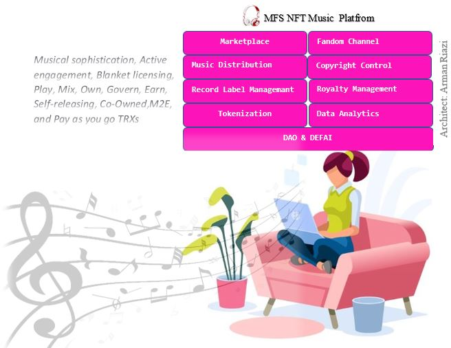

<figure markdown>
{ width="600" height="300" align=center }
<figcaption>As merry as a mars cricket</figcaption>
</figure>

> What exactly are music NFTs?
Music NFTs generally fall under two categories. The first is ownership-based NFTs, which “are basically tied to IP [intellectual property] rights and royalties. So, when you buy the NFT, you now are entitled to the accrual of revenue that is produced from Web2 audio streaming platforms like Spotify, Apple Music, etc.” [^1].
The second is patronage-based NFTs, which do not grant holders any ownership rights but “are collected to support an artist.” According to Levy, “The upside of the NFT is sort of derived from appreciating secondary sales.”[^1].
Spotify says it paid out $7 billion in royalties in 2021 alone, a figure the company claims “is the largest sum paid by one retailer to the music industry in one year in history.” But the vast majority of that money went directly to record labels and publishers, which collect enormous percentages for themselves before passing what’s left on to the artists. Plus, Spotify reportedly pays only $0.003 to $0.005 per stream, and major record labels negotiate higher payouts than independent artists receive[^1].
At first glance, NFT music could be a blockchain alternative for purchasing songs from iTunes. However, when you buy a song from iTunes, you only buy the rights to listen to that track. There is no ownership of the content on iTunes — only the license to listen to what you just paid for. In contrast, musical NFTs allow anyone to listen to music and also grant ownership of that music to the holder.
NFT music seems counter-intuitive: why buy the music you can already listen to? The answer to this question is the same as buying a JPEG image, anyone can right-click and save it. Markets, or people, find value in ownership of original and unique proven assets[^2].
There is a wide range of potential use cases for musical NFTs. They can be used to provide access to discounted concert tickets, special areas at concerts, or meet and greets. It all depends on how the artist wants to structure the NFTs they generate[^2].
Catalogs are the leading marketplace for single-issue music NFTs, a category known as 1/1 in the NFT world. It is based on the Zora protocol and also powers one of OpenSea’s competitor marketplace. As of February 2021, the artist has sold $ 2 million worth of music NFTs in its catalog[^2].
Some artists like to release limited editions, e.g. 10 NFTs tied to a track, as opposed to 1/1s.Where collectors or traders can create edits of a musical NFT. These newly created NFTs can be instantly resold on secondary markets like OpenSea or Rarible. Some DAOs offer grants to NFT artists. Holders vote each month to donate ETH to three musicians through crowdfunding[^2].
Other DAOs are investment-oriented. Noise DAO started with 65 initial members who have accumulated 1,720 ETH to date, with the mission to incubate NFT artists and invest in NFT music[^2].
The platform also has other innovative features: Artists can take out DeFi loans against the value of royalties they generate over a year. DeFi investors can stake crypto assets to provide funding and receive high returns — though the DeFi risks remain[^2].
How about Music NFT Videos, anyways?
Perhaps because it’s a more capital-intensive venture than other aspects of music NFTs, there aren’t many music video NFT projects[^2].

[^1]: DeYoung, J. (2023, January 11). Music NFTs are helping independent creators monetize and build a fanbase. Cointelegraph. https://cointelegraph.com/news/music-nfts-are-helping-independent-creators-monetize-and-build-a-fanbase

[^2]: What you probably don’t know about Music NFTs!! (2022, April 30). CryptoStars. https://blog.cryptostars.is/what-you-probably-dont-know-about-music-nfts-fe7504d5e1

