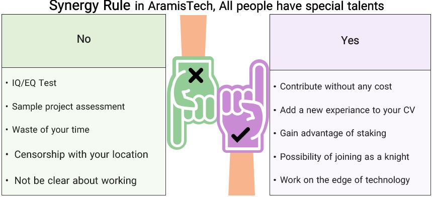

1.  Study [manifesto](../manifesto/manifesto_for_employment.md)

2.  Initial Comparison of candidates without an interview.

3.  Receive an email: If a candidate is accepted, we will send an email. We strongly believe all candidates have special talent or experience, so we do not have a special test (easy to find a solution by surfing the internet and asking on social media) or unrelated materials (e.g., IQ score) to offer you. You found us and selected the group successfully, which means you have enough IQ or EQ. We do not offer you to make a sample project as a task assessment and obligate you to do it because we think it is a waste of your time to do a project after 3–7 days and then send it to us for review without any kind of guarantee! You are easygoing, as are we! i.e., we see you as a member of the Army. You will work on the desired scope of work, and then we will send you permissions via links.

4.  [Five Steps to Join](./steps-to-join.md)

5.  We will review your work after one sprint or slot (viz., 2-4 iterations). Every iteration is equal to one week.

6.  After being accepted, we have to have an interview. If you are not being accepted there are rewards. e.g., you are a UI/UX (or a developer) and you joint our community and you helped to increase our followers by being your existence or maybe you had done a design for advertisements or website. However, you would not have joined the army. So, for these candidates there are some promotion and reward. They can show off their work as a internship experience on their CV with reputation of our brand. We have discretion for using their work in the future and you are still in our network; however, they will take a portaion of the `Army Staking Program (ASP)`. We will have staked 2% of our token(MFS). ASPs mechanism will be locked on our platform or mightbe in a third party. Finally, discarded candidates of army will have earned a profit by distribution of program.

---

`Notice`

For example, we have 1300 candidates in our army currently; you'd better know there is a limitation ASP. It must not exceed of 300 candidates. We may have 1000 candidate in the army, and they were going to do. It is clear for us when they have not done any tasks on Github. So, we only distribute profits to active users who had done at least one successful task or at least 2 failed task. So, we provide rewards in spite of the fact that he/she failed to do a task successfully in the opinion of the admisistrator.

**We only emphasize on activity(failed or success) and every kind of activity has gotten a reward.**

**We carried out our proposed token distribution with all programs (as pointed out) for every kind of registering and formal correcpondace with voucher innovations/research instituations. So it is not possible for us to ignore our plan and strategies.**

7.  After being accepted, you will join as a full-time knight. You will be one of our formal co-worker, and we will utilize 17-19% of shares alongside so many other benefits that  recruiters will speak about it during the final interview. So, in all process and steps, we will have one or two interviews with you because most of your success depends on your activity, and reports that we will be given.

