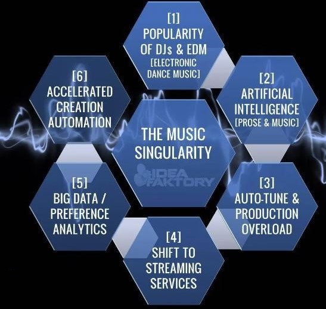
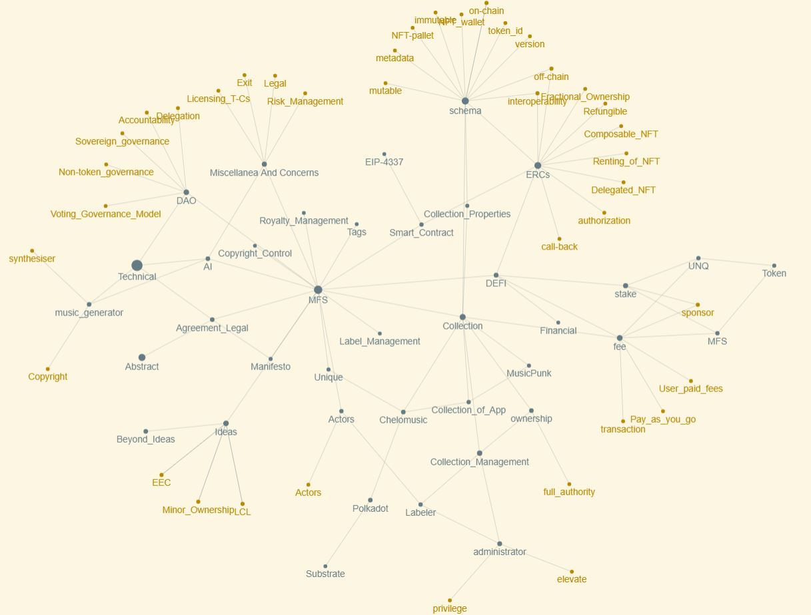

---

<figure markdown>
{ height="400" width="400" align=right }
{ height="400" width="400" align=left }
</figure>

---

> **MFS: a music NFT decentralized blanket licensing platform**

> *As merry as a mars cricket*

> **Play, Mix, Own, Govern, Earn, Self-releasing, Co-Owned, M2E, and Pay as you go TRXs**

# Notice

> We have not released the LTS version yet. At the following link, you will know that there are stable and draft versions. So, both of them do not count as latest-version-Stable.ASAP, we will release links with the LTS flag.

# Environmental issues
> The environmental consequences of NFTs can no longer go unaddressed. **ETH 2.0 still generates 10 million mcg CO2 per Mint!** *(Equivalent to charging your smartphone nine times).*

> **One NFT mint on our infrastructure is a mere 1.2 mcg CO2.** A human exhales 30 times more CO2 in one exhale.Enjoy scalability (6000 tps), painless transactions *(It is not just for saying that we can claim it)*
>
> Sociable Weaver - A seamless UX/UI with blockchain under the hood for organizations and individuals to manage assets like music.

# Papers

The whitepaper is under publishing but you can get it by sending an email. Because of scammer attacks, I can not mention the chapter of book and publisher. we are working on our solution without pay attention to our competitors. Even it is good news that show that how competitors find power-full of our work. In fact, we do not have competitors because all strategies and technical works are really unique in the industry.

<!--
## Whitepaper-stable-version v0.1.0-june-2023

- [x] [Public/Limited Whitepaper(Pdf)](https://drive.google.com/file/d/1MzfAVVbeF8C-G73cEpEcAVGu4dwY9yny/view?usp=sharing)

- [ ] [Request via zenodo link/Whitepaper(Pdf)](https://drive.google.com/file/d/119Tnl4XAr_1_1m-W2h71GlYAJvqOKXQAA/view?usp=sharing)

## Financial-paper-draft-version v0.1.0-june-2023

- [x] [Public/DFinancialpaper(Pdf)](https://drive.google.com/file/d/1hm12ETub0MTbTFtJJBB5_gSAp_pMmlSO/view?usp=sharing)

## Technical-paper-stable-version v0.1.0-june-2023

- [ ] Technical paper is also available only for persons that sending request via [zenodo](https://zenodo.org/record/8023208)

## Full-paper-stable-version v0.1.0-june-2023

- [ ] Full paper is also available only for persons that sending request via [zenodo](https://zenodo.org/record/8023208)

> Backup method: Papers are available only for persons that sent a email to: `armanriyazi.github.io@gmail.com` with title: `Request Technical or full Paper-armanriyazi.github.io`

> Presented with respects

-->

# Contact

> The paper is a summary of the main paper. So, for joining our community or making a contribution to our proposed work, it would be great to [fill out the form for contributors](forms/Form_partnership.md). We will send you an invitation link, and then we will have a meeting to find out your purpose or approach. Finally, you will gain access to the main resources and new ideas of the MFS NFT platform.

- [Author](https://armanriazi.github.io/services)
- [My NFT Metaverse Space](https://oncyber.io/@armanriazi)

---

<figure markdown>
{ width="800" height="600" align=center }
<figcaption>Knowledge Graph</figcaption>
</figure>

---

> Running the project (**localhost**) and accessing the full paper will be explained in an online meeting.

- [DApp underwork (coming soon)](https://mfs.app)
- [Github NFT Music](https://github.com/armanriazi/nft-music-reference)

<!--
[mfs-music.netlify.app(coming soon)](https://mfs-music.netlify.app)

[mfs-music.vercel.app(coming soon)](https://mfs-music.vercel.app)

[nft-music.vercel/netlify.app(coming soon)](https://nft-music.x.app)
-->

---

- *[Aramistech-MFS(zendo community)](https://zenodo.org/communities/aramistech-mfs)*

- *[InterRegEurope](https://www.interregeurope.eu/project-ideas/nft-music-platform)*

- *[Metaverse Space. A.R](https://oncyber.io/spaces/KDVwdvMNh569X8RzLwoV)*
  
- *[Aramistech-Logo](./assets/logo/)*
  > Add the name of file to the link: 
  > AramisTech-Logo{0-9}.{png/jpg}