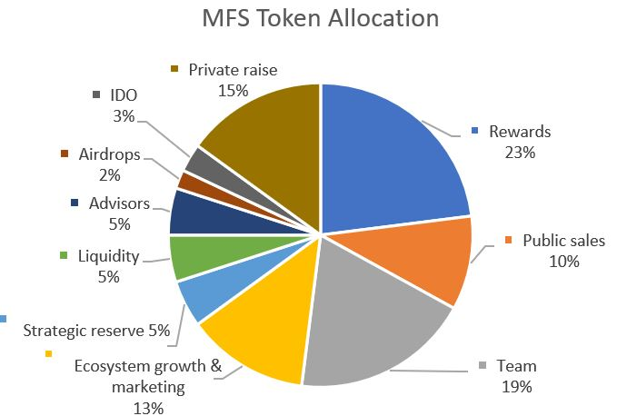
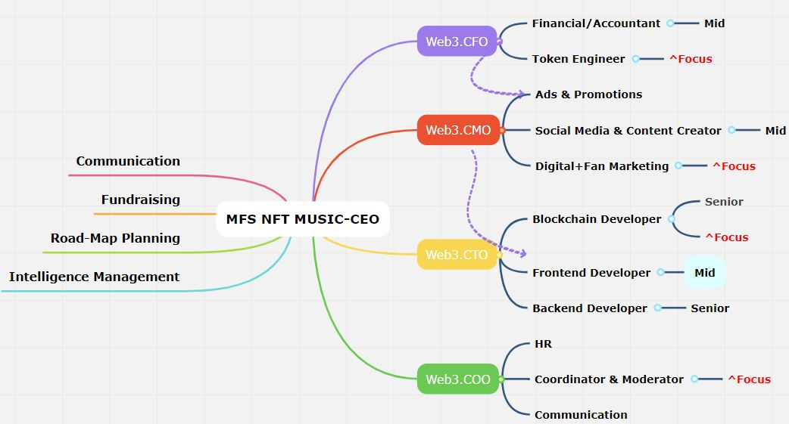

> NOTICE OF CONFIDENTIALITY([Terms and Conditions](Concern_Legal/Agreement_Legal.md))
Case studies, comparisons, statistics, research, and recommendations are provided “AS IS” and intended for informational purposes only and should not be relied upon for operational, marketing, legal, technical, tax, financial, or other advice. AramisTech . neither makes any warranty or representation as to the completeness or accuracy of the information within this document, nor assumes any liability or responsibility that may result from reliance on such information. The Information contained herein is not intended as investment or legal advice, and readers are encouraged to seek the advice of a competent professional where such advice is required. All of details of papers were registered. The paper that you are reading is not a final version, so it is possible that some sections will have minor changes.

> MFS is the short name of the platform, and it is going to be  mentioned  in the final version of the paper.

**Token distribution, chart, and choice of initial asset model.eg., IDO/IEO that could change in partnerships with new partners and long-term beneficial strategies based on the opinions of experts**

### Overview of Token Valuation

<figure markdown>
{ width="600" height="600" align=center }
<figcaption> MFS Token distribution </figcaption>
</figure>

# Overview of the team
AramisTech is trying register its business as a private limited company. We are an IT services and web 3.0 company. We specialize in providing development solutions to startups and development.
The MFS team must have extensive experience across all relevant sectors - from e-commerce, to cryptocurrency, marketing, blockchain, music production, and web application. Crucially, the team would has ”done this before”, and possesses all the experience needed to realize MFS.

<figure markdown>
{ width="600" height="400" align=center }
<figcaption>Fig 9. MFS HR-Chart</figcaption>
</figure>

We have some bench resources for immediate onboarding or a preferred relocation in the near future.

---

> Setting up a new business without a doubt, an exciting endeavor. This could bring all of us a lot of great things in the future.

> The paper is a summary of the main paper. So, for joining our community or making a contribution to our proposed work, it would be great to [fill out the form for contributors](../forms/Form_job_application.md) or [LinkedIn company page](https://www.linkedin.com/company/aramistech). We will send you an invitation link, and then we will have a meeting to find out your purpose or approach. Finally, you will gain access to the main resources and new ideas of the MFS NFT platform.

## Recruiting

Our team is skilled and dedicated to providing top-notch services. If you're interested in working with us, please let us know. We would be happy to discuss you.We are currently recruiting an blockchain start-up. We're looking for experts who have prior experience and they can deal tokens against their work.

### We're Looking For Candidates in some vacancies With

> Knowledge of the NFT space is an obligation for all positions.

#### Technical

> Having knowledge or hands-on experience would be better: ({ description of the role })

1.  2+ years Rust (Develop customized music engine and a little develop smart contracts)
1.  2+ years Substrate (regarding unique network)
2.  2+ years TypeScript (Develop smart contracts and implementing ERC-X standards based on unique network)
3.  2+ years ReactJS (Admin and user panel with regarding to NFTs based on mode of web 3.0)
4.  2+ Music producer, Digitized sounds

`Responsibilities:`

- [x] Self-organization and Self-management
- [x] Working with the team of developers and closely with CTO.

#### CFO

- [x] Knowledge of the web 3.0 space
- [x] Financial/Accountant

#### Marketing, CEO, COO

- [x] Knowledge of the web 3.0 space
- [x] ref. the chart

### Bonus Points For

- [ ] Polkadot, Unique network  experience
- [ ] Previously worked for a startup

A HUGE benefit of this role is being able to work remotely from ANYWHERE in the world - with flexible working hours too!

### What we offer

- [x] Fully remote asynchronous working
- [x] After fund rising, Competitive salary + token package

If you're interested, reach out to me arman2job@google.com with title `Employment in the AramisTech {your desired position}` or apply directly with your CV by the form.

---

Best regards,

*Arman Riazi, CTO*

> I have founded the start-up. I wrote papers, and I ran the beginning of communication and development alone. I am to make money after raising capital. So, I would like to work for myself under the Umbrella of AramisTech to boost our power team by the time we will be given shares as a stakeholder. ref. token distribution. 
> As we pointed out, you can start your journey in AramisTech. We are engaged to find partnerships to form the company, and you only need to keep tuned and fill out the form.
