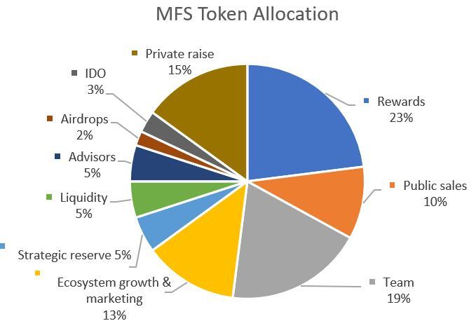
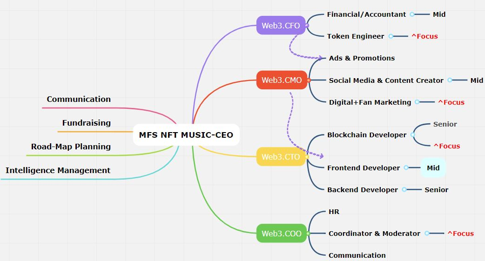

> NOTICE OF CONFIDENTIALITY([Terms and Conditions](../Concern_Legal/Agreement_Legal.md))
Case studies, comparisons, statistics, research, and recommendations are provided “AS IS” and intended for informational purposes only and should not be relied upon for operational, marketing, legal, technical, tax, financial, or other advice. 21Crickets . neither makes any warranty or representation as to the completeness or accuracy of the information within this document, nor assumes any liability or responsibility that may result from reliance on such information. The Information contained herein is not intended as investment or legal advice, and readers are encouraged to seek the advice of a competent professional where such advice is required. All of details of papers were registered. The paper that you are reading is not a final version, so it is possible that some sections will have minor changes.

> MFS is the short name of the platform, and it is going to be  mentioned  in the final version of the paper.

**Token distribution, chart, and choice of initial asset model.eg., IDO/IEO that could change in partnerships with new partners and long-term beneficial strategies based on the opinions of experts**

### Overview of Token Valuation
Think of tokens like a stock, which builds value from…

- [x] Dividends
- [x] Buybacks
- [x] Price appreciation
- [x] Size of the market
- [x] Number of tokens
- [x] Momentum and price dynamics

<figure markdown>
{ width="600" height="600" align=center }
<figcaption>Fig 7. MFS Token distribution</figcaption>
</figure>

We’re able to tackle via a very simple three step process:

1.  Traction Strategy Sprint - Produce the signals of traction that the target VC demographic market will expect based on our prior conversations with our VC partners.
2.  Market Validation - Eliminate probable objections with proactive feedback from our select VC partners.
3.  Fundraising Support - Together, conduct an impactful roadshow and close funding rounds with confidence to help set-up our company for long term future success.

# Overview of the team
21Crickets is trying register its business as a private limited company. We are an IT services and web 3.0 company. We specialize in providing development solutions to startups and development.
The MFS team must have extensive experience across all relevant sectors - from e-commerce, to cryptocurrency, marketing, blockchain, music production, and web application. Crucially, the team would has ”done this before”, and possesses all the experience needed to realize MFS.

<figure markdown>
{ width="600" height="400" align=center }
<figcaption> MFS HR-Chart </figcaption>
</figure>

We have some bench resources for immediate onboarding or a preferred relocation. Relocating is depends on negotiations and the conclusion of contracts with business partners. Our location will be  United Arab Emirates,Schengen area, or Singapore.e.g, Schengen visa applicants(business visa applicants) will usually be asked to present certain documentation such as:
a letter of invitation (by the a country of Schengen) business partner.

# New Partnership

We also could create a core team to look after the various functions of the company. These workers could be sent from the partner office to the new team 21Crickets and also align them with the company’s vision and mission.

## Welcome VCs and angel investors

The mission of the company is to receive at least USD $150,000 in funding or investment from a third-party venture capitalist (VC) or angel investor duly accredited by a government agency.
Our company is to be incubated by an incubator or accelerator recognized by the government, so we welcome having an established business network and entrepreneurial track record. Kindly, make your decision in which section you are able to join 21Crickets.

- [x] Raised funding from capital providers including government investment, venture capitalists, corporates, and business angels.
- [x] Developed, produced or commercialized tech products, services or platforms.
- [x] Registered patents with an approved national IP institution.
- [x] Ongoing research collaboration with a research institution.

---

> Setting up a new business without a doubt, an exciting endeavor. This could bring all of us a lot of great things in the future.

We are in step with technology and dedicated to providing top-notch services If you're interested in working with us, please let us know. We would be happy to discuss you.

> The paper is a summary of the main paper. So, for joining our community or making a contribution to our proposed work, it would be great to [fill out the form for contributors](../forms/Form_partnership.md) or [LinkedIn company page](https://www.linkedin.com/company/21Crickets). We will send you an invitation link, and then we will have a meeting to find out your purpose or approach. Finally, you will gain access to the main resources and new ideas of the MFS NFT platform.

Best regards,

Arman Riazi
