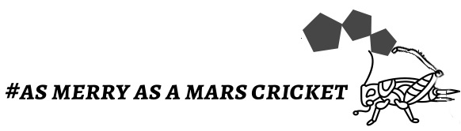
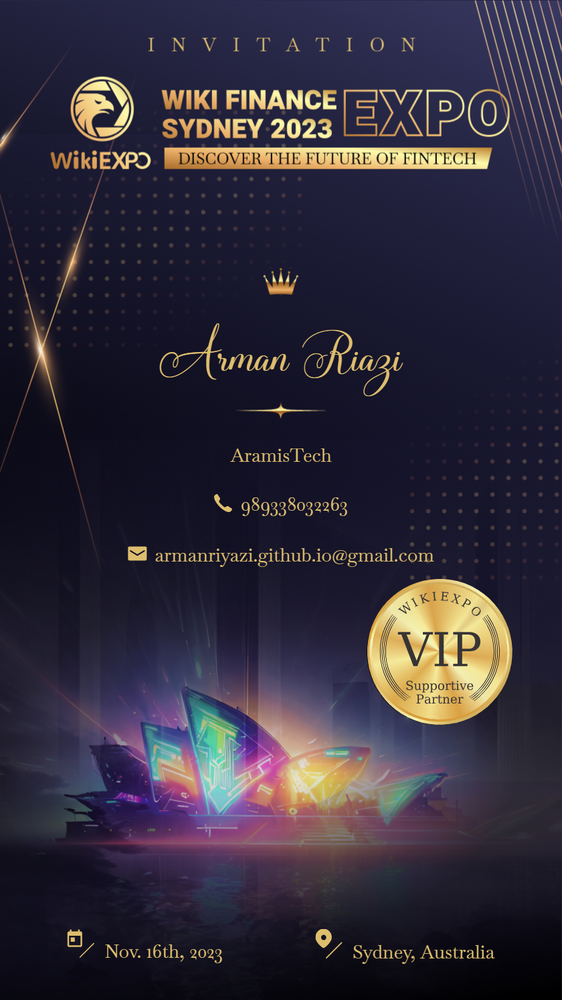
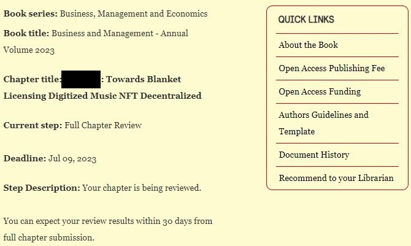

<figure markdown>
{ width="400" height="50" align=center }
<figcaption>As merry as a mars cricket</figcaption>
</figure>

---

[TOC]

---

# News

## 10/2023
### Listed in the Wellfound
We created a company profile in the [wellfound](https://wellfound.com/company/21Crickets) and publish a new [jobs](https://wellfound.com/company/21Crickets/jobs). We are in the process of [fundraising](https://wellfound.com/company/21Crickets/funding)

### Polkadot Hackathon Global Series: APAC Edition 2023
21Crickets has registered in the Polkadot Hackathon Global Series: APAC Edition 2023.
APAC has a feature like daemon service to connect experts or contributors to each other or as a solo. In spite of that, Arman Riazi is waiting to team up for a hackathon with the following subject; He had hoped to get it hold of; before getting behind the deadline because work on dynamic NFTs of Unique network needs more time and having ready a team with the inclusion of TS, (Rust, not for this step) and ReactJS as a part of needed experiences in short and midterm. As we are in the progress of initializing the start-up, we are to need few cloud services like a VPS for developing and implementing an MVP and also gain authorization (based on a new location without the sanction of China or the USA) for our start-up. This authorization will help us after the event to own our prize on September 6th. In spite of the prize, we need to contribute in the event for many reasons to expand our community. So, we invite you to help us to reach higher targets in the amazing music industry.

> Interfaces & Experiences

> Unique Network

> The dynamic NFT Lab

> Winner – Up to $5000

*To read a part of break news of event:* Building upon the momentum generated by our previous hackathons, we rally all builders in the Asia Pacific (APAC) region to join us on this journey. With Polkadot as your foundation, this hackathon is your chance to be at the forefront of blockchain innovation across 5 themes: Interfaces & Experiences, ink! Smart Contracts, Web3 & Tooling, XCM Integration, and Mass Adoption. To sweeten the deal, shortlisted finalists will have the incredible opportunity to pitch their ideas at dotSocial: **Seoul on September 6 2023**, gaining unparalleled exposure and recognition for their exceptional projects.
[Polkadot Global Series](https://www.polkadotglobalseries.com/?utm_source=dotdiscord&utm_medium=socials&utm_campaign=launch)

<figure markdown>
{ width="250" height="500" align=center }
<figcaption>21Crickets in the HACKETON  July 23rd, 2023.</figcaption>
</figure>

## 07/2023
### Sydney Event, Partnership with WikiExpo 
The Sydney event is coming! It will take place on November 16th, 2023. We are in the fields of Blockchain, Web 3.0, Cryptocurrency, Fintech, NFTs, and Metaverse. We took out VIP Pass from our partnership viz WikiExpo. We get proud to be part of the Wiki Expo programs.

<figure markdown>
{ width="250" height="500" align=center }
<figcaption>21Crickets in the WIKI EXPO.Nov 16th, 2023.</figcaption>
</figure>

## 06/2023
### Posted jobs on Linkedin
[Posted jobs on Linkedin-06/18/2023](https://linkedin.com/company/21Crickets)

# Report
## 06/2023
### Release unique-chain
[Release unique-chain](https://github.com/UniqueNetwork/unique-chain/releases/tag/v942057_)
By return to [unique-nft-marketplace-important-announcement](https://unique.network/blog/unique-nft-marketplace-important-announcement/)

### Publish our proposal business work
[Publish our proposal business work-06/20/2023](https://www.intechopen.com/)

<figure markdown>
{ width="600" height="400" align=center }
<figcaption>Require a help funding to publish on the Business, Management and Economics book.</figcaption>
</figure>

